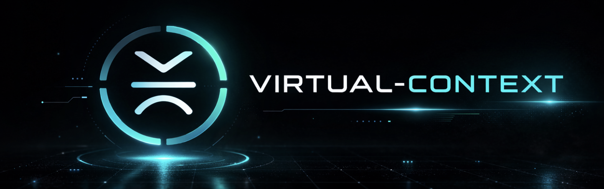

<p align="center">
  
</p>

# virtual-context

**Your LLM never forgets. Even in a 500-turn conversation.**

virtual-context orchestrates a layered pipeline of LLM inference, embedding similarity, deterministic heuristics, and algorithmic rules (each compensating for the others' blind spots) to maintain a living, compressed memory of unbounded conversations.

LLMs have fixed context windows. When conversations grow long, most systems do one of two things: silently drop your oldest messages, or embed everything into a vector database and hope cosine similarity finds what matters. Both fail in predictable ways. The architecture decision from turn 12 vanishes when turn 80 arrives. The legal filing deadline gets evicted because the user asked about dinner recipes. A vague question like "what did we discuss earlier?" returns nothing because it doesn't embed close to anything specific.

virtual-context takes a fundamentally different approach. It treats LLM context the way an operating system treats RAM: tagging every exchange by topic, compressing intelligently, and paging in the right context exactly when needed. Broad queries load everything. Temporal queries seek back to specific points in time. Tag overlap and IDF scoring surface the right segment even when the user's vocabulary doesn't match the original discussion. And a two-tagger architecture (learned the hard way in production) ensures the system can never hallucinate irrelevant topics into your context window.

```
Layer 0: Raw conversation turns              (active memory, in the context window)
Layer 1: Segment summaries per tag           (compressed pages, per-topic summaries)
Layer 2: Tag summaries via greedy set cover   (working set descriptors, bird's-eye view)
```

The result: an LLM that recalls details from turn 12 at turn 200 with the same fidelity as if the conversation just started.

## Why Not Just Use RAG?

RAG retrieves by similarity. virtual-context manages by understanding.

| | Truncation | RAG | virtual-context |
|---|---|---|---|
| **What gets kept** | Most recent N messages | Whatever embeds close to the query | Everything, at varying compression |
| **Cross-topic recall** | Fails silently | Depends on embedding quality | Tag overlap guarantees retrieval |
| **"What did we discuss?"** | Only recent context | Poor (query is too vague to embed) | Broad detection loads all summaries; temporal detection retrieves by time position |
| **Token efficiency** | Wastes budget on irrelevant turns | Retrieved chunks may not fit budget | Budget-aware assembly with priority ordering |
| **Content exceeds window** | Truncate or fail | Chunk and lose coherence | Collapse cold topics to make room, page in what's needed |
| **Bidirectional control** | None | None (append-only) | Expand topics to full detail, collapse back to summaries, within fixed budget |
| **Interpretability** | None | Opaque similarity scores | Visible tags, matched segments, budget breakdown per request |
| **Latency** | Zero | Embedding computation per query | Subsecond with local models |

## How It Works

Two hooks into your LLM pipeline. Pick whichever integration fits:

**Option A: HTTP Proxy (zero code changes).** Point your existing LLM client at `localhost:5757` instead of the upstream API. The proxy handles everything transparently (inbound tagging, retrieval, history filtering, response tagging, compaction). Works with any client that speaks OpenAI, Anthropic, or Gemini API format. Includes a [live dashboard](#live-dashboard) for real-time monitoring and tuning.

```bash
virtual-context proxy --upstream https://api.anthropic.com
# Then change your client's base_url to http://127.0.0.1:5757
```

**Option B: Python SDK.** Two function calls wrap your existing LLM pipeline:

```python
from virtual_context import VirtualContextEngine, Message

engine = VirtualContextEngine(config_path="./virtual-context.yaml")

# BEFORE sending to LLM - retrieve relevant stored context
assembled = engine.on_message_inbound(
    message="What was the Henninger filing deadline?",
    conversation_history=messages,
)
# assembled.prepend_text → enriched system prompt with retrieved summaries
# assembled.matched_tags → ["legal", "filing"]
# assembled.broad → False (this is a specific query)
# assembled.temporal → False (no time-position reference)

# AFTER LLM responds - tag, index, compact if needed
report = engine.on_turn_complete(messages)
if report:
    print(f"Compacted {report.segments_compacted} segments, freed {report.tokens_freed:,} tokens")
```

Everything happens synchronously, in-process, in under a second with a local model. No external services, no background workers, no async complexity.

### The Full Pipeline

```
User message arrives
    │
    ▼
Session routing (proxy mode)
    │  ├─ Extract session ID from <!-- vc:session=UUID --> markers in assistant messages
    │  ├─ Route to existing session or load persisted state from store
    │  ├─ No marker? → reuse default session (first request) or create new
    │  └─ Strip session markers before forwarding to upstream
    │
    ▼
Strip client envelope (OpenClaw metadata, channel headers, plugin markers)
    │
    ▼
History ingestion (first request only)
    │  └─ Extract and tag all prior user+assistant pairs → bootstrap TurnTagIndex
    │
    ▼
Inbound tagging - identify what this message is about
    │  ├─ Embedding tagger (recommended): cosine similarity against existing tag vocabulary
    │  │   (closed-set, deterministic, can't hallucinate novel tags)
    │  ├─ LLM / keyword tagger: alternative with vocabulary feedback
    │  ├─ Tag canonicalization: "db" → "database", alias detection via edit distance
    │  └─ Broad/temporal detection: regex + LLM flags for vague or time-referencing queries
    │
    ▼
Retrieve matching summaries from store
    │  ├─ Broad query? → load ALL tag summaries (bounded post-compaction)
    │  ├─ Temporal query? → load segment summaries sorted earliest-first (Layer 1)
    │  ├─ Query expansion: primary tags + related tags widen the search
    │  ├─ Overfetch 3x → IDF-weighted re-rank (rare tag matches score higher)
    │  ├─ FTS fallback: if tag overlap finds nothing, full-text search on stored segments
    │  └─ Deep retrieval: full stored segment fetch for top matches
    │
    ▼
Assemble context within token budget
    │  ├─ Context hint: lightweight <context-topics> block (~50-200t)
    │  └─ Tag sections: retrieved summaries ordered by tag priority
    │
    ▼
Filter conversation history
    │  ├─ Drop turns whose tags don't overlap with inbound tags
    │  ├─ Preserve tool chains atomically (tool_use ↔ tool_result never separated)
    │  ├─ Protect recent turns (always kept regardless of tags)
    │  └─ Broad/temporal queries skip filtering entirely
    │
    ▼
Inject <virtual-context> block → forward enriched request to LLM
    │
    ▼
LLM processes enriched context → produces response
    │
    ▼
Inject session marker into response (proxy mode)
    │  ├─ Streaming: emit final SSE delta with <!-- vc:session=UUID -->
    │  └─ Non-streaming: append marker to last text content block
    │
    ▼
Response tagging - LLM tags the full user+assistant pair (background thread)
    │  ├─ Context lookback: feed N recent pairs as tagger context for short/ambiguous messages
    │  ├─ Context bleed gate: embedding similarity blocks stale context on topic shifts
    │  ├─ Retry on _general: if tagger returns only _general, retry with expanded context
    │  ├─ Authoritative tags written to TurnTagIndex (vocabulary-building)
    │  ├─ Related tags generated for cross-vocabulary retrieval
    │  └─ Compactor generates related_tags at write time (vocabulary bridging)
    │
    ▼
Check token thresholds (soft 70%, hard 85%)
    │
    ▼ (if threshold exceeded)
Segment by tag → summarize each segment (concurrent, ThreadPoolExecutor)
    │  ├─ Tags preserved: LLM can ADD refined/related tags but never REMOVE originals
    │  └─ Related tags written into stored segments for future cross-vocabulary retrieval
    │
    ▼
Compute greedy set cover → build/update per-tag summaries (Layer 2)
    │
    ▼
Persist engine state (TurnTagIndex + compaction watermark → store)
```

## Key Capabilities

### Tags Emerge From Conversation

There are no predefined domains to configure. An LLM tagger reads each turn and generates semantic tags (`database`, `auth`, `fitness`, `legal`) that naturally converge over the session. A vocabulary feedback loop passes known tags back into the tagger prompt, so it reuses `storage` instead of inventing `data-persistence` or `file-management`.

The same codebase handles legal briefs, medical notes, coding sessions, recipe planning, and marathon training, whatever the user talks about. Tag rules let you configure priority, TTL, and custom summary prompts per tag family using fnmatch patterns.

### Two-Tagger Architecture

This design was born from a production bug. The original system used a single LLM tagger for both inbound (before the LLM responds) and response (after) tagging. In a live OpenClaw deployment, a user message about *electronics* caused the LLM inbound tagger to hallucinate the tag `planes` (because `planes` existed in the active vocabulary and shared abstract secondary tags like `engineering` and `design`). That single hallucinated tag pulled 11 irrelevant history turns into the context window, contaminating the LLM's response with planes, guitars, and jiu-jitsu.

The fix was architectural: split inbound and response tagging into two fundamentally different operations.

**Inbound tagger** (embedding, runs before LLM responds): Uses sentence-transformers (`all-MiniLM-L6-v2`) to compute cosine similarity between the user's message and the existing tag vocabulary. Closed-set: it can only return tags that already exist in the TurnTagIndex. It cannot hallucinate `planes` for an electronics message because the embedding of "tell me about arduino circuits" is semantically far from `planes` and close to `electronics`. Deterministic, subsecond, zero LLM cost.

**Response tagger** (LLM, runs after LLM responds): Sees the full user+assistant pair and generates authoritative semantic tags. This is the creative, vocabulary-building pass, inventing new tags when new topics emerge, generating related tags for cross-vocabulary retrieval, and detecting broad/temporal query intent. Runs in a background thread so it never blocks the next request.

The inbound tagger drives retrieval and filtering (what stored context to inject, which history turns to keep). The response tagger drives the permanent record (what tags describe this turn for all future queries). Each tagger is optimized for its task: the inbound tagger prizes safety (never contaminate the context), the response tagger prizes richness (capture every nuance for future recall).

### Broad Query Detection

"What did we discuss earlier?" "Can you summarize everything?" "What did you say about image storage?"

These queries don't map cleanly to specific tags. The tagger flags them as `broad: true`, and the system switches behavior:

- The retriever loads **all** tag summaries instead of filtering by tag overlap
- History filtering includes all remaining turns instead of dropping unrelated ones
- Post-compaction, broad queries are **bounded**: compacted messages are skipped (tag summaries replace them), preventing token blowout

This eliminates the failure mode where the LLM says "I don't recall discussing that" about something from 50 turns ago.

### Temporal Query Detection

"Going back to the very beginning, what were the key decisions?" "What did we set up with tokens at the start?" "Something you said early on about indexing."

These queries reference a *position in time*, not just a topic. The tagger flags them as `temporal: true`, and the retriever switches to a different data path:

- Instead of merged **tag summaries** (Layer 2), it fetches granular **segment summaries** (Layer 1)
- Segments are sorted by creation time (**earliest first**), so foundational decisions surface before later refinements
- Deep retrieval pulls full stored segment content for the top matches

This solves a fundamental problem with summarization: when a tag like `project-structure` appears at turn 1, turn 57, and turn 71, a merged tag summary blends all three. A temporal query about "the very first thing we discussed" needs the turn-1 segment specifically, not the merged blob.

Detection uses two layers (same pattern as broad): the LLM detects temporal intent, and deterministic regex patterns catch phrases the LLM misses (`"at the beginning"`, `"early on"`, `"the very first thing"`).

### Context Awareness Hints

After compaction, the LLM loses visibility into what topics have been stored. virtual-context injects a lightweight `<context-topics>` block into the system prompt:

```xml
<context-topics>
Prior conversation topics available for recall:
- recipes (15 turns): recipe app development, schema design for ingredients...
- running (8 turns): half-marathon training plan, knee injury prevention...
- housing (10 turns): rent stabilization law, tenant rights under DHCR...
- auth (12 turns): JWT implementation, OAuth2 flow, session management...
</context-topics>
```

This costs ~50-200 tokens and enables a natural drill-down loop: the user asks a broad question, the LLM sees what's available, synthesizes or asks for clarification, and the next turn pulls full detail via narrow tag retrieval. When paging is enabled, the hint also includes tool usage rules: use `find_quote` for specific facts (names, numbers, decisions), `expand_topic` for deeper understanding of a listed topic, and `collapse_topic` to free budget.

### Virtual Memory Paging

RAG retrieves content and appends it to the context window. It never frees space from what's already there. When a 100k document needs to enter a 120k window that already has 60k of conversation history, RAG has three options: truncate (lossy), error (useless), or chunk (every chunking approach either costs extra user turns, loses cross-chunk coherence, or both). Nobody touches the existing 60k. It sits there, potentially full of stale context from 30 turns ago that nobody needs anymore.

virtual-context treats the context window as managed memory. The three-layer compression hierarchy (raw turns, segment summaries, tag summaries) already stores data at every depth level. Paging makes this hierarchy bidirectional: topics can be expanded to full original detail or collapsed back to summaries, and the working set reshapes itself around whatever the user needs right now.

```
Tag summaries  <------->  Segment summaries  <------->  Full stored text
     ^                          ^                            ^
  collapse                   default                      expand
  (~200t)                  (~2,000t)                   (~8,000t+)
```

When the LLM needs more detail on a topic ("What was the exact sourdough timing?"), it expands that topic from summary to full text. When budget pressure hits, cold topics are automatically collapsed. A 100k document enters the window by collapsing 60k of stale conversation to 8k of summaries, freeing 52k. The working set (a per-session map of which topics are loaded at which depth) persists across turns, so expansion decisions are stateful: recipes stays expanded until explicitly collapsed or evicted by budget pressure.

**Model-tiered delegation.** Not all LLMs are equally capable of managing their own context. Weaker models (Haiku, small open-source) get a simplified topic list and can request expansions, but virtual-context handles all eviction decisions silently. Stronger models (Opus, Sonnet, GPT-4) see a full budget dashboard with token costs per topic, available budget, and depth levels, making explicit trade-off decisions. In both modes, virtual-context enforces budget constraints and falls back to automatic management when the LLM doesn't manage. The LLM drives, virtual-context enforces, like `madvise()` hints with kernel enforcement.

**Full-text search.** When tag-based retrieval misses (content filed under an unexpected topic, detail too specific for summaries), `find_quote` searches the raw stored conversation text directly, bypassing tags entirely. Results include the matching excerpt plus all tags on the segment, so the LLM can chain into `expand_topic` for broader context. This is the escape hatch for the fundamental limitation of any tag-based system: content that exists in storage but is tagged under the wrong domain.

**Live MCP via proxy.** The proxy intercepts `tool_use` blocks in the LLM's streaming response, fulfills `expand_topic`, `collapse_topic`, and `find_quote` calls from the engine, and injects `tool_result` back into the conversation, all within a single client-visible request. The LLM can chain tools within one turn (e.g. `find_quote` → discover tag → `expand_topic`), using up to 5 continuation loops transparently. Every proxy-connected client gets MCP-equivalent tool access with zero configuration, zero client-side changes, and zero extra user turns.

### Three-Layer Memory Hierarchy

**Layer 0: Raw turns.** The live conversation in the context window. Protected recent turns are never compacted.

**Layer 1: Segment summaries.** When token pressure hits thresholds, consecutive same-tag turns are grouped and summarized by an LLM. Each segment preserves key decisions, entities, specific names, and action items. Original tags are never lost; the LLM can add tags during summarization but never remove them.

**Layer 2: Tag summaries.** A greedy set cover algorithm finds the minimum set of tags that covers every turn. For each cover tag, all segment summaries are rolled up into a single tag-level summary. A focused session might produce 3 cover tags; a sprawling multi-topic session produces 10+. Only stale summaries (where new segments exist since the last build) are recomputed.

### Two-Tier Compaction

Compaction mirrors OS page replacement:

- **Soft threshold (70%)**: proactive compaction. Summarize now while there's headroom.
- **Hard threshold (85%)**: mandatory compaction. Summarize immediately or the context window overflows.

Compaction is greedy-batch: everything between the watermark and the protected zone gets compacted in one pass, so it fires infrequently (one big batch instead of many small ones). Summarization runs concurrently via ThreadPoolExecutor, with order-preserving results and per-tag custom prompts.

### Tag Canonicalization

Tags naturally produce synonyms: `db`, `database`, `data-storage`. The TagCanonicalizer detects aliases via edit distance and normalizes them automatically. You can also register aliases manually:

```bash
virtual-context aliases suggest    # auto-detect potential aliases
virtual-context aliases add db database
```

### Automatic Tag Refinement

When a tag appears on too many turns (crossing configurable frequency thresholds), it loses discriminative power: proxy filtering keeps all matching turns, pulling unrelated history. virtual-context detects these overly-broad tags and automatically refines them.

An LLM pass examines all turns under the broad tag and determines whether they span distinct sub-topics. If they do, the tag is split into specific compound sub-tags. If the content is genuinely uniform (one topic that happens to be frequent), a tag summary is built instead. Each tag is only processed once; the result is persisted so split analysis doesn't re-trigger.

**Production example** (143-turn OpenClaw session):

`reservation-request` appeared on 43/143 turns (30.1%), spanning platform debugging, availability searches, browser session management, and general booking discussion. The splitter broke it into four sub-tags:

| Sub-tag | Turns | Content |
|---------|-------|---------|
| `reservation-platform-troubleshooting` | 11 | Debugging OpenTable/Resy platform issues |
| `reservation-availability-search` | 5 | Checking time slots and availability |
| `reservation-browser-access` | 4 | Getting logged-in browser sessions |
| `reservation-general` | 20 | General booking coordination |

`troubleshooting` appeared on 34/143 turns (23.8%), spanning browser connectivity issues, restaurant lookups, booking platform interaction, and credential access. Split into `browser-connection-troubleshooting` (11), `restaurant-lookup-troubleshooting` (7), `booking-platform-troubleshooting` (7), `credential-access-troubleshooting` (7).

This is the second emergent property of the system. Vocabulary convergence (the first) naturally collapses synonyms into canonical tags. Tag splitting pushes unrelated concepts apart. Together they create a two-sided pressure (convergence pulls related concepts together, splitting pushes unrelated concepts apart) and the vocabulary evolves toward maximum discriminative power without manual curation.

Split tags are registered as aliases via TagCanonicalizer, so historical queries against the old tag still resolve. New sub-tags enter the vocabulary feedback loop immediately. The splitter never reuses existing tag names (which would cause cascading splits); it always creates new compound tags.

```yaml
tag_generator:
  tag_splitting:
    enabled: true
    frequency_threshold: 15       # min absolute turn count
    frequency_pct_threshold: 0.15  # min fraction of total turns
    max_splits_per_turn: 1        # max tags to split per on_turn_complete cycle
```

### Cross-Vocabulary Retrieval

Users don't use the same words every time. A discussion about "materialized views for feed performance" at turn 46 might be recalled as "that caching trick for the feed" at turn 71. Pure tag overlap finds nothing; the vocabularies are completely disjoint.

virtual-context solves this with two complementary mechanisms:

**Related tag expansion.** Both the tagger (query-side) and compactor (write-side) generate `related_tags` (alternate terms someone might use to refer to the same concepts). A segment about "materialized views" gets stored with related tags like `caching`, `precomputed`, `feed-optimization`. A query about "caching trick" generates related tags that overlap with stored segments. The retriever expands its search to include both primary and related tags.

**IDF-weighted scoring.** When multiple segments match, common tags like `database` (appearing on 20+ segments) shouldn't score the same as rare tags like `postgres` (appearing on 3). The retriever computes inverse document frequency weights from tag usage counts, overfetches 3x the needed results, then re-ranks by `sum(IDF[tag])`. Related tag matches score at 0.5x weight. The correct segment surfaces even when all overlapping tags are high-frequency.

### Budget-Aware Assembly

The assembler builds context within a strict token budget, with priority ordering from tag rules:

```yaml
tag_rules:
  - match: "architecture*"
    priority: 10          # always included first
  - match: "debug*"
    priority: 7
    ttl_days: 7           # debugging context expires fast
  - match: "*"
    priority: 5
    ttl_days: 30
```

Higher-priority tags get assembled first. If the budget runs out, lower-priority summaries are dropped. The budget breakdown is fully transparent: core context, context hint, tag sections, and conversation history each have their own allocation.

## Install

```bash
pip install virtual-context
```

Optional extras:

```bash
pip install virtual-context[tui]         # interactive chat terminal
pip install virtual-context[bridge]      # HTTP proxy (FastAPI + uvicorn)
pip install virtual-context[embeddings]  # sentence-transformers tag generator
pip install virtual-context[tiktoken]    # exact token counting
pip install virtual-context[mcp]         # Model Context Protocol server
pip install virtual-context[all]         # everything
```

Minimal dependencies: `pyyaml` + `httpx`. Python 3.11+.

## Configuration

Create `virtual-context.yaml` in your project root:

```yaml
version: "0.2"
storage_root: ".virtualcontext"
context_window: 120000

# Tags emerge from conversation - the LLM generates them
tag_generator:
  type: "llm"                               # "llm", "keyword", or "embedding"
  provider: "ollama"
  model: "qwen3:4b-instruct-2507-fp16"
  min_tags: 5
  max_tags: 10
  keyword_fallback:                          # used if LLM unavailable
    tag_keywords:
      legal: [court, filing, motion, attorney]
      code: [function, bug, deploy, API, database]
  tag_splitting:                              # auto-refine overly-broad tags
    enabled: true
    frequency_threshold: 15                   # min absolute turn count
    frequency_pct_threshold: 0.15             # min fraction of total turns

# Per-tag behavior: priority, expiration, custom summary prompts
tag_rules:
  - match: "architecture*"
    priority: 10
    ttl_days: null                           # never expire
    summary_prompt: |
      Summarize architectural decisions and tradeoffs.
      Preserve component names and rationale.

  - match: "debug*"
    priority: 7
    ttl_days: 7                              # debugging context stales fast

  - match: "*"
    priority: 5
    ttl_days: 30

# Compaction triggers
compaction:
  soft_threshold: 0.70                       # proactive
  hard_threshold: 0.85                       # mandatory
  protected_recent_turns: 6
  max_concurrent_summaries: 4

# Context awareness hint (post-compaction topic list)
assembly:
  context_hint_enabled: true
  context_hint_max_tokens: 200

# Local LLM for tagging + summarization
providers:
  ollama:
    type: "generic_openai"
    base_url: "http://127.0.0.1:11434/v1"

storage:
  backend: "sqlite"
  sqlite:
    path: ".virtualcontext/store.db"
```

See `virtual-context.yaml.example` for the full annotated configuration.

Generate a starter config from a preset:

```bash
virtual-context init coding    # tuned for software development
```

## Three Tag Generators

**LLM tagger** (recommended for response tagging): Uses any local model via Ollama, LM Studio, or vLLM. Generates rich semantic tags with broad/temporal query detection and related tag generation. Vocabulary feedback ensures convergence: the tagger sees all existing tags and reuses them instead of inventing synonyms. Falls back to keyword tagger if the LLM is unavailable. This is the creative, vocabulary-building tagger that runs after the LLM responds.

**Keyword tagger**: Deterministic regex and keyword matching. Zero latency, zero cost, fully reproducible. Good for domains with well-defined vocabularies where you don't want LLM variability.

**Embedding tagger** (recommended for inbound tagging): Uses sentence-transformers (`all-MiniLM-L6-v2`) to compute cosine similarity against the existing tag vocabulary. Closed-set by design: it can only return tags that already exist, making it impossible to hallucinate novel tags that contaminate retrieval. Understands semantic relationships ("font-weight" matches `css`, "deadlift form" matches `fitness`) without needing exact keyword overlap.

## CLI

```bash
virtual-context status                         # tag stats and token usage
virtual-context tags                           # list all tags with counts
virtual-context domains                        # all tags with turn counts and summaries
virtual-context recall auth                    # retrieve stored summaries for a tag
virtual-context compact -i msgs.json           # manual compaction from message file
virtual-context retrieve -m "What about auth?" # tag + retrieve (JSON output)
virtual-context transform -m "What about auth?"# tag + retrieve + assemble
virtual-context aliases list                   # show all tag aliases
virtual-context aliases suggest                # auto-detect potential aliases
virtual-context aliases add db database        # register alias manually
virtual-context proxy -u https://api.anthropic.com  # single-instance proxy
virtual-context proxy                               # multi-instance (from config)
virtual-context config validate                # check config syntax
virtual-context cost-report                    # show session LLM usage
```

## Interactive Chat (TUI)

```bash
pip install virtual-context[tui]
virtual-context chat --config virtual-context.yaml
```

A terminal chat interface with live context visualization, useful for development, testing, and seeing exactly what virtual-context does at each turn:

- **Tag panel**: current tag working set with activity levels, updated live as `on_turn_complete` processes each turn
- **Budget bar**: real-time token usage breakdown (core, tags, hint, conversation)
- **Turn list**: every turn with its tags, navigable with Ctrl+B/F
- **Turn inspector** (Ctrl+I): full turn data: API payload, tags, assembled context, broad/temporal flags
- **Brief mode** (Ctrl+T): silently appends "answer in 2 lines" for faster iteration during testing
- **Manual compaction**: type `/compact` or press Ctrl+K to trigger compaction on demand
- **Session export** (Ctrl+S): saves full session to `vc-session.json` with all metadata

### Headless Mode

Run prompts through the full pipeline without a terminal UI, ideal for automated stress testing and regression validation:

```bash
virtual-context chat --headless --replay prompts.txt
```

Session JSON captures every turn with tags, token counts, and timing. Replay a saved session to test behavior changes against recorded conversations:

```bash
virtual-context chat --replay vc-session.json
```

## Integrations

### HTTP Proxy

```bash
pip install virtual-context[bridge]
```

The fastest path to production. The proxy sits between any LLM client and an upstream provider, running the full virtual-context pipeline on every request. The client just changes its `base_url`. No SDK integration, no code changes, no plugin required.

Start the proxy:

```bash
# Anthropic upstream
virtual-context -c virtual-context.yaml proxy --upstream https://api.anthropic.com

# OpenAI upstream
virtual-context -c virtual-context.yaml proxy --upstream https://api.openai.com --port 8080

# Custom host/port
virtual-context -c virtual-context.yaml proxy -u https://api.anthropic.com --host 0.0.0.0 --port 9090
```

**Multi-instance mode.** Run multiple proxy listeners on different ports, each forwarding to a different upstream provider, sharing a single engine and store. Configure in YAML instead of CLI flags:

```yaml
proxy:
  instances:
    - port: 5757
      upstream: https://api.anthropic.com
      label: anthropic
    - port: 5758
      upstream: https://api.openai.com/v1
      label: openai
    - port: 5760
      upstream: https://generativelanguage.googleapis.com
      label: gemini
```

```bash
virtual-context -c virtual-context.yaml proxy
# No --upstream needed; instances are read from config
# Each port gets its own dashboard showing the instance label
```

All instances share the same `VirtualContextEngine`, `ProxyMetrics`, and storage backend. Tags and summaries built from conversations on one port are available for retrieval on all others.

Point your client at the proxy:

```python
# Python (anthropic SDK)
import anthropic
client = anthropic.Anthropic(base_url="http://127.0.0.1:5757")

# Python (openai SDK)
from openai import OpenAI
client = OpenAI(base_url="http://127.0.0.1:5757/v1")

# curl
curl http://127.0.0.1:5757/v1/messages \
  -H "x-api-key: $ANTHROPIC_API_KEY" \
  -H "content-type: application/json" \
  -H "anthropic-version: 2023-06-01" \
  -d '{"model":"claude-haiku-4-5-20251001","max_tokens":256,"messages":[{"role":"user","content":"Hello"}]}'
```

**Session continuity.** The proxy injects an invisible `<!-- vc:session=UUID -->` marker into every assistant response. Client SDKs store this as part of the message. On subsequent requests, the proxy extracts the marker, routes to the correct session, and strips markers before forwarding upstream. If the proxy restarts, it loads persisted engine state (TurnTagIndex + compaction watermark) from the store, so no re-ingestion is needed. Multiple concurrent conversations are routed independently via a session registry.

**History ingestion.** On the first request, the proxy extracts user+assistant pairs from the client's existing conversation history and tags each to bootstrap the TurnTagIndex. No cold-start period; the tag vocabulary is immediately available for inbound matching.

**Format-agnostic.** Auto-detects Anthropic, OpenAI, and Gemini request formats via a `PayloadFormat` strategy pattern and injects context accordingly: into `system` for Anthropic, into `messages[0]` for OpenAI, into `system_instruction.parts` for Gemini. Paging tool interception works across Anthropic and Gemini formats (`tool_use`/`tool_result` and `functionCall`/`functionResponse` respectively).

**Streaming with zero added latency.** SSE streams are forwarded byte-for-byte as they arrive from upstream. Text deltas are accumulated in the background for response tagging. The user sees no delay.

**Error-resilient.** If the engine fails (config error, tagger timeout, etc.), the request is forwarded to upstream unmodified. The proxy never blocks your LLM calls.

**Envelope stripping.** Strips client metadata (channel headers, message footers, event lines, plugin markers) so the tagger sees clean conversational content. Handles consecutive user messages from Telegram-style batching gracefully.

**Terminal logging.** Every event is logged to stdout in real-time:

```
[INGEST] 43 turns in 45123ms (session=a1b2c3d4e5f6)
[T44] POST anthropic stream=True tags=[css, design] msgs=52 dropped=25 ctx=312t input=8421t vc=89ms | help me with some css styling
[T44] RESPONSE stream=True llm=3028ms total=3117ms chars=117
[T44] COMPLETE 1204ms tags=[css, web-development, html] primary=css
```

#### Live Dashboard

The proxy serves a real-time monitoring dashboard at `http://localhost:5757/dashboard`, a full operational view of what virtual-context is doing to every request.

**Request grid.** Every proxy request displayed with turn number, inbound tags, response tags (updated live when `on_turn_complete` finishes), token counts, latency breakdown (vc overhead vs upstream LLM), broad/temporal flags, and turns dropped by filtering. Newest requests appear on top. Each row is clickable for deep inspection.

**Turn inspector.** Click any request row to see the full picture: every message in the request with role labels, content block types (`text`, `tool_use`, `tool_result`, `thinking`), the raw text content, inbound tags vs response tags side by side, and the token budget breakdown showing how context was assembled.

**Ingested history.** When the proxy bootstraps from a client's existing conversation, every ingested turn appears in its own grid with per-turn tags and message previews, so you can verify the tag vocabulary was built correctly from history.

**Session stats.** Uptime, total requests processed, compaction events, total tokens freed, compression ratio, average VC overhead latency, and average upstream LLM latency.

**Request capture.** A ring buffer stores the last 50 raw request bodies (the actual `messages` array sent to the upstream LLM). Inspect any captured request through the dashboard or export as JSON for offline analysis. Essential for diagnosing tagger accuracy: you can see exactly what text the embedding matcher evaluated.

**Live updates.** SSE-powered: new events appear the instant they happen. No polling, no refresh.

**JSON export.** Download the full session state (all events, all stats) as a single JSON file for offline analysis or bug reporting.

### MCP Server (Model Context Protocol)

```bash
pip install virtual-context[mcp]
```

Exposes virtual-context as an MCP server for integration with Claude Desktop, Cursor, or any MCP-compatible client:

| Type | Name | Description |
|------|------|-------------|
| Tool | `recall_context` | Tag + retrieve + assemble context for a message |
| Tool | `compact_context` | Trigger compaction on a message history |
| Tool | `domain_status` | All tags with stats |
| Tool | `expand_topic` | Expand a topic to segment or full detail depth |
| Tool | `collapse_topic` | Collapse a topic back to summary or none |
| Tool | `find_quote` | Full-text search across all stored conversation text |
| Resource | `virtualcontext://domains` | List all tags |
| Resource | `virtualcontext://domains/{tag}` | Summaries for a specific tag |
| Prompt | `recall` | Suggest context retrieval for a topic |
| Prompt | `summarize_session` | Suggest compaction |

### OpenClaw Plugin

Plugin for OpenClaw agents using lifecycle hooks for sync retrieval (`message.pre`) and fire-and-forget compaction (`agent.post`) via CLI calls. No bridge server needed. Depends on the [plugin lifecycle hook architecture](https://github.com/openclaw/openclaw/pull/12082) currently in progress.

## Architecture

### Core Components

| Component | File | Purpose |
|-----------|------|---------|
| **Engine** | `engine.py` | Main orchestrator: `on_message_inbound()`, `on_turn_complete()`, `ingest_history()` |
| **TurnTagIndex** | `core/turn_tag_index.py` | Live per-turn tag index, velocity tracking, greedy set cover |
| **TagGenerator** | `core/tag_generator.py` | LLM and keyword semantic tagging with vocabulary feedback |
| **EmbeddingTagGenerator** | `core/embedding_tag_generator.py` | Sentence-transformers cosine similarity against tag vocabulary |
| **TagCanonicalizer** | `core/tag_canonicalizer.py` | Alias detection, plural folding, normalization |
| **Retriever** | `core/retriever.py` | IDF-weighted tag retrieval, related tag expansion, broad/temporal queries, FTS fallback |
| **Assembler** | `core/assembler.py` | Budget-aware context assembly with priority ordering |
| **Monitor** | `core/monitor.py` | Two-tier threshold detection (soft/hard) |
| **Segmenter** | `core/segmenter.py` | Turn pairing + contiguous tag grouping via TurnTagIndex |
| **Compactor** | `core/compactor.py` | LLM summarization + tag summary rollup, concurrent via ThreadPoolExecutor |
| **CostTracker** | `core/cost_tracker.py` | Per-session LLM usage and cost tracking |
| **ContextStore** | `core/store.py` | Storage interface (SQLite or filesystem) |
| **PayloadFormat** | `proxy/formats.py` | Strategy pattern for Anthropic/OpenAI/Gemini request/response handling |
| **ProxyServer** | `proxy/server.py` | HTTP proxy: enrichment, filtering, history ingestion, session continuity |
| **MultiInstance** | `proxy/multi.py` | Multi-instance launcher: N uvicorn listeners sharing one engine/store |
| **ProxyDashboard** | `proxy/dashboard.py` | Live SSE dashboard with request grid, turn inspector, session stats |
| **ProxyMetrics** | `proxy/metrics.py` | Thread-safe event collector + request capture ring buffer |

### Storage Backends

**SQLiteStore**: Primary backend. Two FTS5 indexes (summary search for retrieval, full-text search across raw stored conversation text for `find_quote`), tag-overlap queries via junction table, tag aliases, tag summaries. Single file, no external dependencies.

**FilesystemStore**: Debug/inspection backend. Markdown files with YAML frontmatter, organized by tag directory. Human-readable, git-friendly.

Both implement the same abstract interface; swap backends without changing application code.

### LLM Providers

**GenericOpenAIProvider**: Works with Ollama, LM Studio, vLLM, or any OpenAI-compatible endpoint. Pure httpx, no SDK dependency.

**AnthropicProvider**: Direct Anthropic API via httpx. No SDK dependency.

Retry logic with exponential backoff on both.

## Design Decisions

**Sync-first.** Zero async/await in the engine. All I/O is synchronous httpx. Concurrent compaction uses `ThreadPoolExecutor`, not asyncio. Both engine entry points complete in under a second with a local Ollama model. The proxy uses FastAPI async for HTTP handling but calls the sync engine via `asyncio.to_thread`.

**Two-tagger architecture.** Inbound tagging (before the LLM responds) and response tagging (after) use different models optimized for different tasks. The recommended configuration uses embedding cosine similarity for inbound (closed-set, deterministic, can't hallucinate novel tags) and an LLM for response (creative, vocabulary-building, generates related tags). This separation was driven by a production bug where the LLM inbound tagger hallucinated `planes` for an electronics message, pulling irrelevant history via abstract cross-cutting tags like `engineering` and `craftsmanship`.

**Tag overlap with IDF scoring, not vector similarity.** Retrieval matches by IDF-weighted tag overlap, not cosine similarity. Related tag expansion handles vocabulary mismatch. Faster (no embedding computation at query time), fully interpretable, and composable with the tag hierarchy.

**Vocabulary feedback, not few-shot.** The LLM tagger gets a live vocabulary of tags already used in the session and store, and is instructed to reuse them when the topic matches. Convergence without manual curation.

**No SDK dependencies.** Both LLM providers use raw httpx. The only required dependencies are `pyyaml` and `httpx`.

**Tag preservation.** During compaction, the LLM can add refined tags but never remove original ones. A segment tagged `[ux, recipes, frontend]` stays tagged with all three even after summarization, ensuring cross-topic retrieval always works.

**Tool chain integrity.** The history filter preserves API-required message dependencies atomically. Every `tool_use` block in an assistant message is kept with its corresponding `tool_result`, and vice versa. Forward and backward scanning ensures multi-step tool chains are never broken, even when surrounding turns are filtered out.

## Stress-Tested

virtual-context has been validated across multiple dimensions: adversarial prompt suites, production traffic, and deliberate edge cases.

### Adversarial Prompt Suite

100-turn conversations with deliberately overlapping domains (Flask IoT API, music studio, ML pipeline, cross-domain integration), vocabulary mismatches, ambiguous callbacks, and cross-domain synthesis queries, using a 3,000-token context window with Claude Haiku:

- **Cross-vocabulary recall**: "caching trick for the feed" correctly retrieves "materialized view" despite zero primary tag overlap. Related tag expansion bridges the vocabulary gap
- **IDF-weighted precision**: "precomputed summary table" retrieves the correct segment over 20+ competing segments sharing common tags like `database` and `performance`
- **Ambiguous multi-match**: "what middleware pattern?" correctly identifies both auth and logging middleware across 4 overlapping domains; "plugins - Flask, audio, or ML?" correctly disambiguates
- **Temporal recall**: "going back to the very beginning, what were the key decisions?" retrieves original Flask blueprint architecture from turn 1 via segment-level retrieval, even after 4 compaction events
- **Broad query bounding**: "summary of everything we've discussed" loads 22 bundled tag summaries but stays bounded at ~2,900 tokens post-compaction
- **Adversarial pass rate**: 89% on 28 deliberately adversarial prompts (vocabulary mismatches, ambiguous references, cross-domain synthesis, late vague recalls)
- **Compaction**: 4 events across 100 turns, average 1,147 tokens per turn, peak 3,018 tokens
- **Tag convergence**: vocabulary stabilizes within 10-15 turns via feedback loop

### Production Validation

The proxy has been validated in production with OpenClaw (Telegram bot) handling real multi-topic conversations:

- **Consecutive user message batching**: Telegram sends multiple user messages in rapid succession. The proxy handles misaligned message sequences without losing history pairs
- **Tool chain preservation**: 90-message conversations with interleaved `tool_use`/`tool_result` chains filtered from 52 messages down to 27 without breaking a single tool dependency
- **Embedding inbound matching**: Live tag vocabularies of 40+ tags correctly matched ("help me with css styling" → `[css, design]`, "what about font-weight" → `[css]` via semantic similarity)
- **History ingestion**: 43 pre-existing conversation turns tagged and indexed in a single pass, vocabulary immediately available for subsequent requests

## Development

```bash
git clone https://github.com/virtual-context/virtual-context.git
cd virtual-context
python -m venv .venv && source .venv/bin/activate
pip install -e ".[dev]"
python -m pytest tests/ -v --ignore=tests/ollama    # 911 unit tests
python -m pytest tests/ollama/ -v -m ollama          # integration (requires Ollama)
```

## License

AGPL-3.0, Copyright Y. Ahmed Kidwai

For commercial licensing inquiries, contact: ahmed@kidw.ai
