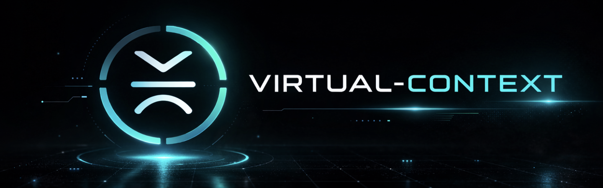

<p align="center">
  
</p>

# virtual-context

**100x your agent's context by virtualizing it. Better reasoning. Unlimited memory. Lower costs.**

*95% accuracy vs 33% baseline on the same model, at half the cost. [See benchmark →](#benchmark-results)*

Your client sets `contextWindow: 20000000` (20 million). Your model's real window is 200K. virtual-context sits between them and makes it work, the same way your OS lets a process address more memory than physically exists. The client sends its full conversation history. VC compresses, indexes, and pages. The model sees a dense 60K window where every token is signal. 

The result is measurably better reasoning, recall and cost than raw full context.

This is what makes virtual-context fundamentally different from memory systems that bolt a vector database onto your LLM. Those systems are *additive*, they retrieve chunks and compete for the context window your agent is working in right now.  These systems are not working to evict or curate the context to what you really need.  

virtual-context *manages* the window itself: compressing by topic, extracting structured facts, paging in what's needed, and paging out what's not. The client thinks it has 20M tokens. The model sees 60K of curated signal. Nothing is lost.  Everything is addressable, at varying levels of compression.

```
Layer 0: Raw conversation turns              (active memory, in the context window)
Layer 1: Segment summaries + Facts per tag   (compressed pages, per-topic summaries)
Layer 2: Tag summaries via greedy set cover   (working set descriptors, bird's-eye view)
```

The result: an agent that recalls details from turn 12 at turn 1000 with the same fidelity as if the conversation just started.

### Configurable Context Ceiling

Most teams set `context_window` to whatever the model supports — 128K, 200K, 1M — and let it fill up. This is expensive and, counterintuitively, degrades quality. Research on "lost in the middle" shows that LLM attention degrades in long contexts: facts buried in 200K tokens of raw history are missed more often than the same facts concentrated in a managed 60K window.

virtual-context lets you set an artificial ceiling well below the model's maximum:

```yaml
context_window: 60000  # run a 200K model at 60K
compaction:
  soft_threshold: 0.70
  hard_threshold: 0.90
```

The compression hierarchy keeps the window within this budget. When the ceiling is hit, compaction fires: stale turns are summarized, facts are extracted and indexed, and the working set reshapes around what's active.

**Cost impact:** A 200K-capable model running at 60K uses ~70% fewer input tokens per request.

**Quality impact:** The model's attention isn't spread across 200K tokens of mostly-stale history. Relevant facts surface through targeted retrieval and structured tools rather than hoping the model notices them buried in a long window.

## Virtual-Context vs RAG vs Compaction

These approaches are complementary, but optimize different failure modes.

| | RAG | Compaction-only | virtual-context |
|---|---|---|---|
| **Primary mechanism** | Query-time retrieval by embedding similarity | Summarize old history to fit window | Tagged memory + retrieval + compaction + paging tools |
| **What gets kept** | External documents + recent raw chat | Summaries of old turns + recent raw chat | Multi-layer memory (raw turns, segment summaries, tag summaries) |
| **Specific fact lookup** | Depends on embedding/query phrasing alignment | Lossy after summarization | `vc_find_quote` + `vc_query_facts` + summary/segment drill-down |
| **Broad overview ("what did we discuss?")** | Weak unless special orchestration | Can summarize, but often generic | `vc_recall_all` returns all topic summaries within budget |
| **Time-scoped recall ("last week", "between June and July")** | Custom logic outside core RAG | Requires date fidelity in summaries | `vc_remember_when` with backend-resolved time ranges |
| **Vocabulary mismatch tolerance** | Embedding-dependent | Low | Related-tag expansion + IDF-weighted ranking + quote search fallback |
| **Context budget control** | Append retrieved chunks | Compression with limited selective rehydration | Explicit paging: expand/collapse topics and bounded assembly |
| **Cost at scale** | Grows with corpus size (more chunks retrieved) | Grows with conversation length (summaries accumulate) | Configurable ceiling: run a 200K model at 30K, ~85% fewer input tokens |
| **Interpretability** | Medium (scores/chunks) | Low-medium (summary quality dependent) | High (tags, tool calls, budgets, sections, stored summaries) |
| **Failure mode** | Miss relevant chunk | Over-compress / lose detail | Requires tool-aware prompting + memory hygiene |
| **Best fit** | Knowledge/doc retrieval | Simple long-chat cost reduction | Long-running agent memory with mixed query types |

virtual-context combines retrieval and compaction, then adds explicit tools for overview/time/fact recall under strict token budgets.

## Cloud Offering / No Infrastructure

[https://virtual-context.com](https://virtual-context.com) offers the fastest way to get going, just sign up and change your base-url.  You'll get statistics, visibility into the context window and cost savings reports. 

## Local Install

```bash
pip install virtual-context
```

Python 3.11+, all core dependencies in the base install. 

Optional storage backends: `pip install virtual-context[postgres]`, `[neo4j]`, or `[falkordb]`.

## Getting Started

Two ways to integrate. Pick whichever fits:

### HTTP Proxy (zero code changes)

Point your existing LLM client at `localhost:5757` instead of the upstream API. The proxy handles everything transparently — inbound tagging, retrieval, history filtering, response tagging, compaction. Auto-detects Anthropic, OpenAI (Chat + Codex/Responses), and Gemini request formats. Includes a [live dashboard](#live-dashboard).

```bash
# Pick your upstream — format is auto-detected per request
virtual-context proxy --upstream https://api.anthropic.com
virtual-context proxy --upstream https://api.openai.com
virtual-context proxy --upstream https://generativelanguage.googleapis.com
```

Then point your client at `http://127.0.0.1:5757`:

```python
# Python (anthropic SDK)
import anthropic
client = anthropic.Anthropic(base_url="http://127.0.0.1:5757")

# Python (openai SDK)
from openai import OpenAI
client = OpenAI(base_url="http://127.0.0.1:5757/v1")
```

No config file needed for basic usage. For customization (LLM tagger, tag rules, multi-instance):

```bash
cp virtual-context.yaml.example virtual-context.yaml
virtual-context -c virtual-context.yaml proxy
```

**Multi-instance mode** — multiple providers on different ports in one process:

```yaml
proxy:
  instances:
    - port: 5757
      upstream: https://api.anthropic.com
      label: anthropic
    - port: 5758
      upstream: https://api.openai.com
      label: openai
    - port: 5760
      upstream: https://generativelanguage.googleapis.com
      label: gemini
```

**Daemon mode** — run as a background service:

```bash
virtual-context onboard --install-daemon --upstream https://api.anthropic.com
```

Daemon setup docs (macOS `launchd`, Linux `systemd --user`, Windows Task Scheduler): [`docs/install.md`](docs/install.md)

### Python SDK

Two function calls wrap your existing LLM pipeline:

```python
from virtual_context import VirtualContextEngine, Message

engine = VirtualContextEngine(config_path="./virtual-context.yaml")

# BEFORE sending to LLM — retrieve relevant stored context
assembled = engine.on_message_inbound(
    message="What was the Henninger filing deadline?",
    conversation_history=messages,
)
# assembled.prepend_text → enriched system prompt with retrieved summaries
# assembled.matched_tags → ["legal", "filing"]

# AFTER LLM responds — tag, index, compact if needed
report = engine.on_turn_complete(messages)
if report:
    print(f"Compacted {report.segments_compacted} segments, freed {report.tokens_freed:,} tokens")
```

Everything happens synchronously, in-process.

### OpenClaw Settings

Set these to allow OpenClaw to maintain large context windows from a client perspective: 

```
  // 1. History limits (the real bottleneck most users will hit)
  // channels.<provider> (e.g. channels.telegram)
  "historyLimit": 99999,
  "dmHistoryLimit": 99999

  // global fallback
  "messages": { "groupChat": { "historyLimit": 99999 } }

  // 2. Model context window — must be on the provider in the per-agent models.json, with
  // explicit model entries:
  "anthropic": {
    "baseUrl": "https://anthropic.virtual-context.com?vckey=...",
    "api": "anthropic-messages",
    "models": [
      {
        "id": "claude-opus-4-6",
        "contextWindow": 2000000,  // Note this is 2M
        ...
      }
    ]
  }
```

  Just setting baseUrl alone isn't enough - without model entries, it falls back to pi-ai's
  hardcoded 200K. And models.overrides in the global config is display only — it doesn't affect
  actual windowing.

```
  3. Context pruning — disable it so the proxy controls windowing:
  "agents": {
    "defaults": {
      "contextPruning": { "mode": "off" },
      "contextTokens": 2000000 // Note this is 2M
    }
  }
```

### MCP Server (Model Context Protocol)

Exposes virtual-context as an MCP server for integration with Claude Desktop, Cursor, or any MCP-compatible client:

| Type | Name | Description |
|------|------|-------------|
| Tool | `recall_context` | Tag + retrieve + assemble context for a message |
| Tool | `recall_all` | Load summaries for all topics (broad overview path) |
| Tool | `remember_when` | Time-scoped recall with relative presets or explicit date bounds |
| Tool | `compact_context` | Trigger compaction on a message history |
| Tool | `domain_status` | All tags with stats |
| Tool | `expand_topic` | Expand a topic to segment or full detail depth |
| Tool | `collapse_topic` | Collapse a topic back to summary or none |
| Tool | `find_quote` | Full-text search across all stored conversation text |
| Tool | `query_facts` | Structured fact lookup with subject/verb/object/status filters |
| Resource | `virtualcontext://domains` | List all tags |
| Resource | `virtualcontext://domains/{tag}` | Summaries for a specific tag |
| Prompt | `recall` | Suggest context retrieval for a topic |
| Prompt | `summarize_session` | Suggest compaction |

### The Full Pipeline

```
User message arrives
    │
    ▼
Session routing (proxy mode)
    │  ├─ Extract session ID from <!-- vc:session=UUID --> markers in assistant messages
    │  ├─ Route to existing session or load persisted state from store
    │  ├─ No marker? → reuse default session (first request) or create new
    │  └─ Strip session markers before forwarding to upstream
    │
    ▼
Strip client envelope + extract metadata
    │  ├─ Parse sender identity from labeled metadata blocks (e.g. Sender, Conversation info)
    │  ├─ Extract original message timestamps from envelope metadata
    │  ├─ Strip channel headers, plugin markers, message footers
    │  └─ Metadata preserved on Message.metadata for downstream use
    │
    ▼
History ingestion (first request only)
    │  ├─ Extract and tag all prior user+assistant pairs → bootstrap TurnTagIndex
    │  ├─ Stub detection: media attachments/image placeholders get _stub tag (skip LLM tagger)
    │  └─ Conversation-scoped: each conversation's index is independent
    │
    ▼
Inbound tagging - identify what this message is about
    │  ├─ Embedding tagger (recommended): cosine similarity against existing tag vocabulary
    │  │   (closed-set, deterministic, can't hallucinate novel tags)
    │  ├─ LLM / keyword tagger: alternative with vocabulary feedback
    │  ├─ Tag canonicalization: "db" → "database", alias detection via edit distance
    │  └─ Temporal detection: regex + LLM flags for time-referencing queries
    │
    ▼
Retrieve matching summaries from store
    │  ├─ Recall-all tool call? → load ALL tag summaries (bounded by token budget)
    │  ├─ Temporal query? → load segment summaries sorted earliest-first (Layer 1)
    │  ├─ Query expansion: primary tags + related tags widen the search
    │  ├─ Overfetch 3x → IDF-weighted re-rank (rare tag matches score higher)
    │  ├─ FTS fallback: if tag overlap finds nothing, full-text search on stored segments
    │  └─ Deep retrieval: full stored segment fetch for top matches
    │
    ▼
Assemble context within token budget
    │  ├─ Context hint: lightweight <context-topics> block (~50-200t)
    │  └─ Tag sections: retrieved summaries ordered by tag priority
    │
    ▼
Filter conversation history
    │  ├─ Drop turns whose tags don't overlap with inbound tags
    │  ├─ Preserve tool chains atomically (tool_use ↔ tool_result never separated)
    │  ├─ Protect recent turns (always kept regardless of tags)
    │  └─ Temporal queries skip filtering entirely
    │
    ▼
Inject <virtual-context> block → forward enriched request to LLM
    │
    ▼
LLM processes enriched context → produces response
    │
    ▼
Inject session marker into response (proxy mode)
    │  ├─ Streaming: emit final SSE delta with <!-- vc:session=UUID -->
    │  └─ Non-streaming: append marker to last text content block
    │
    ▼
Response tagging - LLM tags the full user+assistant pair (background thread)
    │  ├─ Context lookback: feed N recent pairs as tagger context for short/ambiguous messages
    │  ├─ Context bleed gate: embedding similarity blocks stale context on topic shifts
    │  ├─ Retry on _general: if tagger returns only _general, retry with expanded context
    │  ├─ Authoritative tags written to TurnTagIndex (vocabulary-building)
    │  ├─ Fact signal extraction: lightweight subject/verb/object triples per turn
    │  ├─ Related tags generated for cross-vocabulary retrieval
    │  └─ Compactor generates related_tags at write time (vocabulary bridging)
    │
    ▼
Fact curation (on inbound, before assembly)
    │  └─ LLM scores retrieved facts for relevance to current query
    │     Low-relevance facts dropped before assembly
    │
    ▼
Check token thresholds (soft 70%, hard 85%)
    │
    ▼ (if threshold exceeded)
Segment by tag → summarize each segment (concurrent, ThreadPoolExecutor)
    │  ├─ Session dates: forced segment splits on session boundaries
    │  ├─ Sender names: real participant names in summaries (not generic "User")
    │  ├─ Stub segments: media/attachment stubs get passthrough (no LLM), inherit neighbor's tags
    │  ├─ XML-tagged prev_context: structural separation prevents context leak into summaries
    │  ├─ Tags preserved: LLM can ADD refined/related tags but never REMOVE originals
    │  ├─ Fact consolidation: per-turn fact signals → structured Fact records with provenance
    │  └─ Related tags written into stored segments for future cross-vocabulary retrieval
    │
    ▼
Compute greedy set cover → build/update per-tag summaries (Layer 2)
    │
    ▼
Persist engine state (TurnTagIndex + compaction watermark → store)
```

## Key Capabilities

### Tags Emerge From Conversation

There are no predefined domains to configure. An LLM tagger reads each turn and generates semantic tags (`database`, `auth`, `fitness`, `legal`) that naturally converge over the session. A vocabulary feedback loop passes known tags back into the tagger prompt, so it reuses `storage` instead of inventing `data-persistence` or `file-management`. When synonyms do slip through (`db` vs `database`), a canonicalizer detects aliases via edit distance and normalizes them automatically (`virtual-context aliases suggest`).

The same codebase handles legal briefs, medical notes, coding sessions, recipe planning, and marathon training, whatever the user talks about. Tag rules let you configure priority, TTL, and custom summary prompts per tag family using fnmatch patterns.

### Two-Tagger Architecture

virtual-context separates tagging from fact extraction, and splits tagging itself into two distinct operations with different objectives. Most memory systems go straight from raw text to fact/knowledge extraction in a single LLM call, processing each chunk independently with no surrounding context. virtual-context treats these as separate concerns, each with its own extraction strategy and context window.

**Inbound tagger** (embedding, runs before LLM responds): Uses sentence-transformers (`all-MiniLM-L6-v2`) to compute cosine similarity between the user's message and the existing tag vocabulary. Closed-set: it can only return tags that already exist in the TurnTagIndex. Deterministic, subsecond, zero LLM cost. Because it can only match existing tags, it is structurally incapable of hallucinating novel topics into your context window.

**Response tagger** (LLM, runs after LLM responds): Sees the full user+assistant turn pair plus N recent preceding turns (configurable via `context_lookback_pairs`, default 5) as surrounding context. A context bleed gate (embedding similarity threshold) prevents stale context from a previous topic from leaking in on topic shifts. This is the creative, vocabulary-building pass: inventing new tags when new topics emerge, generating related tags for cross-vocabulary retrieval, and extracting per-turn fact signals. Runs in a background thread so it never blocks the next request.

**Context-aware extraction.** The response tagger doesn't process turns in isolation. When the user says "yes, that one" or "can you expand on that?", a tagger seeing only that message has nothing to work with. By feeding surrounding turn pairs with bleed gating, the tagger correctly classifies ambiguous messages and extracts meaningful fact signals even from short, context-dependent replies. If the tagger still returns only `_general`, it retries with expanded context before falling back to tag inheritance from the TurnTagIndex.

The inbound tagger drives retrieval and filtering (what stored context to inject, which history turns to keep). The response tagger drives the permanent record (what tags describe this turn, and what facts it contains, for all future queries). Each tagger is optimized for its task: the inbound tagger prizes safety (never contaminate the context), the response tagger prizes richness (capture every nuance for future recall).

### Broad Overview Tool (`vc_recall_all`)

"What did we discuss earlier?" "Can you summarize everything?" "What did you say about image storage?"

These queries don't map cleanly to specific tags. virtual-context uses an MCP-style tool call:

- `vc_recall_all` (proxy tool loop) / `recall_all` (MCP server) loads **all** tag summaries
- Results are bounded by the configured tag-context token budget
- The reader can follow up with `vc_expand_topic` on specific tags for deeper detail

This eliminates the failure mode where the LLM says "I don't recall discussing that" about something from 50 turns ago.

### Time-Scoped Recall Tool (`vc_remember_when`)

"Going back to the very beginning, what were the key decisions?" "What did we set up with tokens at the start?" "Between June and July, what changed about indexing?"

These queries reference a *position in time*, not just a topic. virtual-context uses an explicit tool call:

- `vc_remember_when` (proxy tool loop) / `remember_when` (MCP server) combines semantic query + structured time range
- Time ranges use relative presets (e.g. `last_week`, `last_month`) or explicit date bounds (`between_dates`)
- Date math is backend-resolved, not LLM-resolved, so results are deterministic and testable

This solves a fundamental problem with summarization: when a tag like `project-structure` appears at turn 1, turn 57, and turn 71, a merged tag summary blends all three. A time-scoped query about "the very first thing we discussed" needs constrained retrieval against early sessions, not a generic merged blob.

### Session Date Propagation

Temporal reasoning requires knowing *when* each piece of information was recorded. virtual-context propagates session dates through the entire pipeline:

```
[Session from 2023/05/25] in user message
    → TurnTagEntry.session_date
    → forced segment split on session change
    → SegmentMetadata.session_date
    → SQLite metadata_json
    → find_quote results: {"session": "2023/05/25"}
    → assembled context: <virtual-context session="2023/05/25">
```

The segmenter forces a new segment boundary whenever the session date changes, even if the primary tag is the same. This guarantees no segment spans multiple sessions. When the reader sees two conflicting facts — "sneakers under my bed" (session 2023/05/25) and "moved sneakers to shoe rack" (session 2023/05/29) — it can determine temporal ordering and answer correctly.

For proxy/OpenClaw conversations, session dates come from envelope metadata timestamps (e.g., `"Tue 2026-03-17 00:35 EDT"` parsed from the `Conversation info` metadata block) or `Message.timestamp`. The compactor prepends a `[Session: March 17, 2026 12:35 AM]` header to each segment's conversation text, so the summarization LLM sees the actual conversation time and can reason temporally (e.g., "last night" vs "two days ago").

### Context Awareness Hints

After compaction, the LLM loses visibility into what topics have been stored. virtual-context injects a lightweight `<context-topics>` block into the system prompt:

```xml
<context-topics>
Prior conversation topics available for recall:
- recipes (15 turns): recipe app development, schema design for ingredients...
- running (8 turns): half-marathon training plan, knee injury prevention...
- housing (10 turns): rent stabilization law, tenant rights under DHCR...
- auth (12 turns): JWT implementation, OAuth2 flow, session management...
</context-topics>
```

This costs ~50-200 tokens and enables a natural drill-down loop: the user asks for an overview, the LLM sees what's available, synthesizes or asks for clarification, and the next turn pulls full detail via narrow tag retrieval. When paging is enabled, the hint also includes tool usage rules and a budget indicator: use `vc_recall_all` for broad overviews, `vc_remember_when` for time-scoped recall, `vc_find_quote` for specific text (names, numbers, decisions), `vc_query_facts` for structured fact lookup (subject/verb/object filters with semantic expansion), `vc_expand_topic` for deeper understanding of a listed topic, and `vc_collapse_topic` to free budget.

### Structured Fact Extraction (`vc_query_facts`)

Summaries compress information but inevitably lose specific details. When the user says "I run 5K every morning" at turn 14, a summary might retain "runs regularly" but drop the exact distance and timing. Most memory systems extract facts in a single LLM pass and trust the output directly: raw text goes in, extracted facts come out, and those facts are stored as-is. virtual-context takes a fundamentally different approach with a two-phase pipeline where per-turn signals are treated as hints, not ground truth.

**Phase 1: Fact signals (per-turn).** The response tagger extracts lightweight subject/verb/object triples from each turn as it's processed, with full surrounding context (the same context lookback and bleed gating used for tagging). "I run 5K every morning" becomes `{subject: "user", verb: "runs", object: "5K every morning"}`. These are fast, cheap, and stored on the TurnTagIndex. Critically, they are not yet committed as permanent facts.

**Phase 2: Fact consolidation (at compaction).** When segments are compacted, per-turn fact signals are verified and consolidated into structured `Fact` records with the full multi-turn segment as context. The consolidation pass can see the complete conversation flow across multiple turns: what the user asked, how the assistant responded, what was clarified or corrected. This means a fact signal from turn 14 gets validated against turns 12-18 before becoming a permanent record. The result is a structured `Fact` with full provenance: subject, verb, what (the core assertion), `fact_type` classification (`preference`, `biographical`, `decision`, `plan`, `opinion`, `routine`, `relationship`, `skill`, `medical`, `financial`, `general`), temporal status (active/completed/planned/abandoned/recurring), associated tags, session ID, and source turn numbers. Facts are stored in dedicated SQLite tables with indexes for efficient querying.

**Why two phases matter.** A single-pass extractor processing "yes, let's go with PostgreSQL" in isolation has no idea what "yes" refers to. It might extract nothing, or hallucinate a fact. virtual-context's response tagger sees the surrounding turns ("Should we use PostgreSQL or MySQL for the user table?") and generates the correct signal. The consolidation pass then verifies it against the full segment before storing a permanent fact. Two chances to get it right, each with progressively more context.

**Querying.** The `vc_query_facts` tool (proxy tool loop) provides structured fact lookup with filters:

```
vc_query_facts(subject="user", verb="runs")
vc_query_facts(object_contains="5K")
vc_query_facts(status="active")
vc_query_facts(fact_type="preference")
```

**Phase 3: Fact curation (on inbound query).** Before assembling context, the `FactCurator` filters retrieved facts for relevance to the current query. An LLM pass scores each candidate fact against the user's message and drops low-relevance facts that would consume budget without adding signal. This prevents the reader from seeing 40 facts when only 3 matter, reducing noise and improving answer precision. Configurable via `curation.enabled` and `curation.model`.

**Fact supersession.** When new information contradicts or updates a previously stored fact ("I moved from NYC to LA"), the supersession checker detects the conflict and marks the old fact as superseded. Detection uses object-keyword similarity to find cross-session candidates that share the same subject and semantic domain, then an LLM verifies whether the new fact genuinely replaces the old one. Superseded facts are retained in storage (for audit) but excluded from query results.

**Fact graph.** Facts aren't isolated triples — they have relationships. "User led Project Alpha" and "Project Alpha uses Python" are connected by a `PART_OF` relationship. "User moved from NYC to LA" `SUPERSEDES` the older "User lives in NYC." virtual-context automatically detects these relationships during the same LLM pass that checks for supersession (zero additional API calls) and stores them as typed, directed links between facts. Six relationship types are supported: `SUPERSEDES`, `CAUSED_BY`, `PART_OF`, `CONTRADICTS`, `SAME_AS`, and `RELATED_TO`. When `vc_query_facts` returns results, linked facts are automatically included via 1-hop traversal — the reader gets richer context without needing to know the graph exists. In SQLite, links are stored in a `fact_links` table with BFS traversal; graph database backends (Neo4j, FalkorDB) represent them as native edges.

**Semantic verb expansion.** Queries like `verb="runs"` automatically expand to morphologically similar verbs in the database (e.g., "running", "run", "jogs") via sentence-transformer embedding similarity. This means the reader doesn't need to guess the exact verb form used during extraction.

**Semantic fact search.** When structured filters return sparse results, a fallback embedding search matches the query intent against all stored facts' `what` fields by cosine similarity, surfacing relevant facts even when the subject/verb/object decomposition doesn't align.

### Virtual Memory Paging

RAG retrieves content and appends it to the context window. It never frees space from what's already there. When a 100k document needs to enter a 120k window that already has 60k of conversation history, RAG has three options: truncate (lossy), error (useless), or chunk (every chunking approach either costs extra user turns, loses cross-chunk coherence, or both). Nobody touches the existing 60k. It sits there, potentially full of stale context from 30 turns ago that nobody needs anymore.

virtual-context treats the context window as managed memory. The three-layer compression hierarchy (raw turns, segment summaries, tag summaries) already stores data at every depth level. Paging makes this hierarchy bidirectional: topics can be expanded to full original detail or collapsed back to summaries, and the working set reshapes itself around whatever the user needs right now.

```
Tag summaries  <------->  Segment summaries  <------->  Full stored text
     ^                          ^                            ^
  collapse                   default                      expand
  (~200t)                  (~2,000t)                   (~8,000t+)
```

When the LLM needs more detail on a topic ("What was the exact sourdough timing?"), it expands that topic from summary to full text. When budget pressure hits, cold topics are automatically collapsed. A 100k document enters the window by collapsing 60k of stale conversation to 8k of summaries, freeing 52k. The working set (a per-session map of which topics are loaded at which depth) persists across turns, so expansion decisions are stateful: recipes stays expanded until explicitly collapsed or evicted by budget pressure.

**Model-tiered delegation.** Not all LLMs are equally capable of managing their own context. Weaker models (Haiku, small open-source) get a simplified topic list and can request expansions, but virtual-context handles all eviction decisions silently. Stronger models (Opus, Sonnet, GPT-4) see a full budget dashboard with token costs per topic, available budget, and depth levels, making explicit trade-off decisions. In both modes, virtual-context enforces budget constraints and falls back to automatic management when the LLM doesn't manage. The LLM drives, virtual-context enforces, like `madvise()` hints with kernel enforcement.

**Full-text search with semantic enrichment.** When tag-based retrieval misses (content filed under an unexpected topic, detail too specific for summaries), `find_quote` searches stored conversation text directly using two complementary strategies. FTS5 handles exact and partial keyword matches. Semantic search (segment text chunked into overlapping windows, embedded with sentence-transformers, matched by cosine similarity) surfaces paraphrased references that share no lexical overlap with the original text. Both run on every query — FTS results are supplemented with semantic matches to fill the result set. Each call returns a fixed top 20 results. Results include the matching excerpt, session date, match type, and all tags on the segment, so the LLM can chain into `expand_topic` for broader context.

**Working-set optimization.** Read-only tools (`find_quote`, `query_facts`, `recall_all`, `remember_when`) skip the expensive context reassembly step. Only `expand_topic` and `collapse_topic` (which change the working set) trigger a full context rebuild. This reduces per-round overhead in tool chains that make multiple read-only calls before expanding.

**Tool loop.** The reader model can chain multiple tool calls within a single turn. After `find_quote` returns a result, the reader can issue another `find_quote` with a refined query, `query_facts` for structured lookup, or follow up with `expand_topic`. Up to 10 continuation rounds run transparently within one client-visible request (configurable via `paging.max_tool_loops`). This is essential for multi-fact questions: "What is the total number of days I spent in Japan and Chicago?" requires two independent `find_quote` calls to locate each trip's details before computing the sum.

**Budget-aware reader prompting.** The context hint tells the reader exactly how many tool rounds it has, encouraging strategic tool use: "You have a maximum of N tool rounds. Plan your strategy upfront: use diverse queries, not repetitions. If a search already returned the answer, stop and respond." This prevents the reader from exhausting all rounds on redundant searches when the answer was found on the first call.

**Multi-provider tool loop.** The tool loop supports Anthropic, OpenAI, and Gemini as reader models via a `ProviderAdapter` pattern. Each adapter handles provider-specific request/response formats, tool call parsing, and context injection. The reader model can be different from the upstream provider — e.g., use GPT-5 Codex as the reader with an Anthropic upstream, or Gemini as the reader with an OpenAI upstream.

**Resilient continuation.** When the tool loop exhausts all rounds and forces a final text-only continuation, transient HTTP errors (server 500s) are retried once with a brief delay before falling back to error state. This prevents a single upstream hiccup from discarding an otherwise complete answer.

**Live MCP via proxy.** The proxy intercepts `tool_use` blocks in the LLM's streaming response, fulfills `vc_recall_all`, `vc_remember_when`, `vc_expand_topic`, `vc_collapse_topic`, `vc_find_quote`, and `vc_query_facts` calls from the engine, and injects `tool_result` back into the conversation, all within a single client-visible request. The LLM can chain tools within one turn (e.g. `vc_recall_all` → `vc_query_facts` → `vc_find_quote` → `vc_expand_topic`), using up to 10 continuation loops transparently. Every proxy-connected client gets MCP-equivalent tool access with zero configuration, zero client-side changes, and zero extra user turns.

### Three-Layer Memory Hierarchy

**Layer 0: Raw turns.** The live conversation in the context window. Protected recent turns are never compacted.

**Layer 1: Segment summaries.** When token pressure hits thresholds, consecutive same-tag turns are grouped and summarized by an LLM. Each segment preserves key decisions, entities, specific names, and action items. Original tags are never lost; the LLM can add tags during summarization but never remove them. Structured facts (subject/verb/object triples with temporal status) are extracted during compaction and stored separately for precise querying via `vc_query_facts`.

**Layer 2: Tag summaries.** A greedy set cover algorithm finds the minimum set of tags that covers every turn. For each cover tag, all segment summaries are rolled up into a single tag-level summary. A focused session might produce 3 cover tags; a sprawling multi-topic session produces 10+. Only stale summaries (where new segments exist since the last build) are recomputed.

### Two-Tier Compaction

Compaction mirrors OS page replacement:

- **Soft threshold (30%)**: proactive compaction. Summarize now while there's headroom.
- **Hard threshold (85%)**: mandatory compaction. Summarize immediately or the context window overflows.

Compaction is greedy-batch: everything between the watermark and the protected zone gets compacted in one pass, so it fires infrequently (one big batch instead of many small ones). Summarization runs concurrently via ThreadPoolExecutor, with order-preserving results, per-tag custom prompts, and per-segment progress logging. The summary prompt preserves exact numbers, proper nouns, and state assertions (e.g., "I now store sneakers on the shoe rack" is never softened to "plans to store").

### Automatic Tag Refinement

When a tag appears on too many turns (crossing configurable frequency thresholds), it loses discriminative power: proxy filtering keeps all matching turns, pulling unrelated history. virtual-context detects these overly-broad tags and automatically refines them.

An LLM pass examines all turns under the broad tag and determines whether they span distinct sub-topics. If they do, the tag is split into specific compound sub-tags. If the content is genuinely uniform (one topic that happens to be frequent), a tag summary is built instead. Each tag is only processed once; the result is persisted so split analysis doesn't re-trigger.

**Production example** (143-turn OpenClaw session):

`reservation-request` appeared on 43/143 turns (30.1%), spanning platform debugging, availability searches, browser session management, and general booking discussion. The splitter broke it into four sub-tags:

| Sub-tag | Turns | Content |
|---------|-------|---------|
| `reservation-platform-troubleshooting` | 11 | Debugging OpenTable/Resy platform issues |
| `reservation-availability-search` | 5 | Checking time slots and availability |
| `reservation-browser-access` | 4 | Getting logged-in browser sessions |
| `reservation-general` | 20 | General booking coordination |

`troubleshooting` appeared on 34/143 turns (23.8%), spanning browser connectivity issues, restaurant lookups, booking platform interaction, and credential access. Split into `browser-connection-troubleshooting` (11), `restaurant-lookup-troubleshooting` (7), `booking-platform-troubleshooting` (7), `credential-access-troubleshooting` (7).

This is the second emergent property of the system. Vocabulary convergence (the first) naturally collapses synonyms into canonical tags. Tag splitting pushes unrelated concepts apart. Together they create a two-sided pressure (convergence pulls related concepts together, splitting pushes unrelated concepts apart) and the vocabulary evolves toward maximum discriminative power without manual curation.

### Emergent Behaviors

- **Vocabulary convergence**: Tag reuse and canonicalization naturally collapse synonyms into stable tag vocabularies over long sessions.
- **Automatic tag refinement**: High-frequency broad tags split into narrower sub-tags, increasing retrieval precision without manual taxonomy work.
- **Tool-first recall loops**: Models tend to converge on `vc_find_quote`/`vc_query_facts`/`vc_recall_all`/`vc_remember_when` → `vc_expand_topic` sequences for multi-step recall.
- **Quote-then-context chaining**: Exact snippets from `find_quote` naturally route follow-up expansion to the right topic context.
- **Fact-then-quote verification**: Structured facts from `query_facts` provide quick answers; the reader chains into `find_quote` to verify or locate the original conversational context.
- **Session-date anchoring**: Time-scoped recall (`vc_remember_when`) biases responses toward chronology-correct evidence.
- **Vocabulary entropy reduction**: Canonicalization + tag feedback lowers random tag drift and improves cross-turn consistency.
- **Budget-shaped recall selection**: Budget-aware assembly consistently favors high-value context under tight token ceilings.
- **Compaction survivorship effects**: Frequently reinforced facts stay highly retrievable, while low-signal details trend toward summary-level recall.
- **Semantic verb bridging**: Verb expansion at query time lets the reader find facts regardless of morphological form — "runs" finds facts stored as "running", "jogging", "exercises".

Split tags are registered as aliases via TagCanonicalizer, so historical queries against the old tag still resolve. New sub-tags enter the vocabulary feedback loop immediately. The splitter never reuses existing tag names (which would cause cascading splits); it always creates new compound tags.

```yaml
tag_generator:
  tag_splitting:
    enabled: true
    frequency_threshold: 15       # min absolute turn count
    frequency_pct_threshold: 0.15  # min fraction of total turns
    max_splits_per_turn: 1        # max tags to split per on_turn_complete cycle
```

### Cross-Vocabulary Retrieval

Users don't use the same words every time. A discussion about "materialized views for feed performance" at turn 46 might be recalled as "that caching trick for the feed" at turn 71. Pure tag overlap finds nothing; the vocabularies are completely disjoint.

virtual-context solves this with two complementary mechanisms:

**Related tag expansion.** Both the tagger (query-side) and compactor (write-side) generate `related_tags` (alternate terms someone might use to refer to the same concepts). A segment about "materialized views" gets stored with related tags like `caching`, `precomputed`, `feed-optimization`. A query about "caching trick" generates related tags that overlap with stored segments. The retriever expands its search to include both primary and related tags.

**IDF-weighted scoring.** When multiple segments match, common tags like `database` (appearing on 20+ segments) shouldn't score the same as rare tags like `postgres` (appearing on 3). The retriever computes inverse document frequency weights from tag usage counts, overfetches 3x the needed results, then re-ranks by `sum(IDF[tag])`. Related tag matches score at 0.5x weight. The correct segment surfaces even when all overlapping tags are high-frequency.

### Budget-Aware Assembly

The assembler builds context within a strict token budget, with priority ordering from tag rules:

```yaml
tag_rules:
  - match: "architecture*"
    priority: 10          # always included first
  - match: "debug*"
    priority: 7
    ttl_days: 7           # debugging context expires fast
  - match: "*"
    priority: 5
    ttl_days: 30
```

Higher-priority tags get assembled first. If the budget runs out, lower-priority summaries are dropped. The budget breakdown is fully transparent: core context, context hint, tag sections, and conversation history each have their own allocation.

This budget enforcement is what makes the configurable context ceiling work in practice. A 30K ceiling doesn't mean losing information — it means the assembler is forced to prioritize, and the compression hierarchy ensures everything is still available at some depth level. The model reasons over a dense, curated context instead of a sprawling raw history.

## Configuration

Create `virtual-context.yaml` in your project root:

See `virtual-context.yaml.example` for the full annotated configuration.


## Three Tag Generators

**LLM tagger** (recommended for response tagging): Use a cheap model from Openrouter or use any local model via Ollama, LM Studio, or vLLM. Generates rich semantic tags with temporal query detection and related tag generation. Vocabulary feedback ensures convergence: the tagger sees all existing tags and reuses them instead of inventing synonyms. Falls back to keyword tagger if the LLM is unavailable. This is the creative, vocabulary-building tagger that runs after the LLM responds.

**Keyword tagger**: Deterministic regex and keyword matching. Zero latency, zero cost, fully reproducible. Good for domains with well-defined vocabularies where you don't want LLM variability.

**Embedding tagger** (recommended for inbound tagging): Uses sentence-transformers (`all-MiniLM-L6-v2`) to compute cosine similarity against the existing tag vocabulary. Closed-set by design: it can only return tags that already exist, making it impossible to hallucinate novel tags that contaminate retrieval. Understands semantic relationships ("font-weight" matches `css`, "deadlift form" matches `fitness`) without needing exact keyword overlap.

## CLI

```bash
virtual-context status                         # tag stats and token usage
virtual-context tags                           # list all tags with counts
virtual-context domains                        # all tags with turn counts and summaries
virtual-context recall auth                    # retrieve stored summaries for a tag
virtual-context compact -i msgs.json           # manual compaction from message file
virtual-context retrieve -m "What about auth?" # tag + retrieve (JSON output)
virtual-context transform -m "What about auth?"# tag + retrieve + assemble
virtual-context aliases list                   # show all tag aliases
virtual-context aliases suggest                # auto-detect potential aliases
virtual-context aliases add db database        # register alias manually
virtual-context proxy -u https://api.anthropic.com  # single-instance proxy
virtual-context proxy                               # multi-instance (from config)
virtual-context presets list                   # list available config presets
virtual-context presets show coding            # dump preset config as YAML
virtual-context daemon status                  # service status (platform-specific)
virtual-context daemon start                   # start/enable daemon
virtual-context daemon stop                    # stop daemon
virtual-context daemon restart                 # stop + start daemon
virtual-context daemon uninstall               # remove daemon definition
virtual-context config validate                # check config syntax
virtual-context telemetry                     # per-component LLM cost, tokens, and timing
virtual-context telemetry --verbose           # per-call event log
virtual-context telemetry --json              # machine-readable output
```

## Interactive Chat (TUI)

```bash
virtual-context chat --config virtual-context.yaml
```

A terminal chat interface with live context visualization, useful for development, testing, and seeing exactly what virtual-context does at each turn:

- **Tag panel**: current tag working set with activity levels, updated live as `on_turn_complete` processes each turn
- **Budget bar**: real-time token usage breakdown (core, tags, hint, conversation)
- **Turn list**: every turn with its tags, navigable with Ctrl+B/F
- **Turn inspector** (Ctrl+I): full turn data: API payload, tags, assembled context, and tool activity
- **Brief mode** (Ctrl+T): silently appends "answer in 2 lines" for faster iteration during testing
- **Manual compaction**: type `/compact` or press Ctrl+K to trigger compaction on demand
- **Session export** (Ctrl+S): saves full session to `vc-session.json` with all metadata

### Headless Mode

Run prompts through the full pipeline without a terminal UI, ideal for automated stress testing and regression validation:

```bash
virtual-context chat --headless --replay prompts.txt
```

Session JSON captures every turn with tags, token counts, and timing. Replay a saved session to test behavior changes against recorded conversations:

```bash
virtual-context chat --replay vc-session.json
```

### Proxy Deep Dive

**Session continuity.** The proxy injects an invisible `<!-- vc:session=UUID -->` marker into every assistant response. On subsequent requests, the proxy extracts the marker, routes to the correct session, and strips markers before forwarding upstream. If the proxy restarts, it loads persisted engine state from the store. Multiple concurrent conversations are routed independently via a session registry.

**Conversation-scoped retrieval.** All store retrieval methods are scoped by `conversation_id`. Multiple conversations sharing the same SQLite database are fully isolated — a new conversation never gets context from another conversation's segments.

**Session suppression.** When a session has no compacted data, the pipeline is suppressed — requests pass through as-is. Once the first compaction runs, the pipeline activates automatically.

**History ingestion.** On the first request, the proxy extracts user+assistant pairs from the client's existing conversation history and tags each to bootstrap the TurnTagIndex. No cold-start period.

**Format-agnostic.** Auto-detects Anthropic, OpenAI (Chat + Codex/Responses), and Gemini request formats. Context is injected into the appropriate location per format. A single proxy instance handles all formats on one port.

**Streaming with zero added latency.** SSE streams are forwarded byte-for-byte. Text deltas are accumulated in the background for response tagging.

**Error-resilient.** If the engine fails, the request is forwarded to upstream unmodified. The proxy never blocks your LLM calls.

**Envelope stripping + metadata extraction.** Strips client metadata while extracting sender identity and timestamps from labeled JSON blocks. Group chat participants appear as "Sania" and "Yur" instead of generic "User". Original message timestamps give segments accurate chronological ordering.

**Per-port config.** Multi-instance setups can give each port its own engine and storage:

```yaml
proxy:
  instances:
    - port: 5757
      upstream: https://api.anthropic.com
      label: anthropic
      config: ./vc-anthropic.yaml    # isolated engine + storage
    - port: 5758
      upstream: https://api.openai.com
      label: openai                   # shares master engine (no config field)
```

#### Live Dashboard

Real-time monitoring at `http://localhost:5757/dashboard`: request grid with tags/tokens/latency, turn inspector, ingestion history, session stats, request capture (last 50 raw payloads), telemetry panel, SSE live updates, JSON export. Dashboard auth via `X-VC-Dashboard-Token` header.

#### Telemetry

Every LLM call is instrumented with token counts, cost, and timing. A `models.yaml` catalog provides pricing for all supported models with alias resolution. Five tracked components: `compactor`, `tagger`, `tool_loop`, `fact_curator`, `proxy_upstream`. Available via dashboard, CLI (`virtual-context telemetry`), or programmatic (`engine.get_telemetry()`).

### OpenClaw Plugin

Plugin for OpenClaw agents using lifecycle hooks for sync retrieval (`message.pre`) and fire-and-forget compaction (`agent.post`) via CLI calls. No bridge server needed. Depends on the [plugin lifecycle hook architecture](https://github.com/openclaw/openclaw/pull/12082) currently in progress.

## Architecture

### Core Components

| Component | File | Purpose |
|-----------|------|---------|
| **Engine** | `engine.py` | Main orchestrator: `on_message_inbound()`, `on_turn_complete()`, `ingest_history()` |
| **TurnTagIndex** | `core/turn_tag_index.py` | Live per-turn tag index, velocity tracking, greedy set cover |
| **TagGenerator** | `core/tag_generator.py` | LLM and keyword semantic tagging with vocabulary feedback + per-turn fact signal extraction |
| **EmbeddingTagGenerator** | `core/embedding_tag_generator.py` | Sentence-transformers cosine similarity against tag vocabulary |
| **TagCanonicalizer** | `core/tag_canonicalizer.py` | Alias detection, plural folding, normalization |
| **Retriever** | `core/retriever.py` | IDF-weighted tag retrieval, related tag expansion, FTS fallback |
| **Assembler** | `core/assembler.py` | Budget-aware context assembly with priority ordering |
| **Monitor** | `core/monitor.py` | Two-tier threshold detection (soft/hard) |
| **Segmenter** | `core/segmenter.py` | Turn pairing + contiguous tag grouping via TurnTagIndex |
| **Compactor** | `core/compactor.py` | LLM summarization + fact extraction + tag summary rollup, concurrent via ThreadPoolExecutor |
| **ModelCatalog** | `core/model_catalog.py` | YAML-based model pricing catalog with alias resolution |
| **TelemetryLedger** | `core/telemetry.py` | Per-call event log with per-component rollup (cost, tokens, timing) |
| **FactCurator** | `ingest/curator.py` | LLM-based fact relevance filtering on inbound queries |
| **SupersessionChecker** | `ingest/supersession.py` | Cross-session fact deduplication via object-keyword similarity |
| **ToolLoop** | `core/tool_loop.py` | Multi-provider multi-round tool execution for reader model (Anthropic/OpenAI/Gemini) |
| **ContextStore** | `core/store.py` | Storage ABC (SQLite, filesystem, Postgres) with conversation-scoped retrieval |
| **PayloadFormat** | `proxy/formats.py` | Strategy pattern for Anthropic/OpenAI/Gemini request/response handling |
| **LLMUtils** | `core/llm_utils.py` | Shared JSON parsing (markdown fences, think tags) + tag normalization |
| **ProxyServer** | `proxy/server.py` | HTTP proxy factory (`create_app`), delegates to state/registry/handlers |
| **ProxyState** | `proxy/state.py` | Session state machine: ingestion, tagging, compaction lifecycle |
| **SessionRegistry** | `proxy/registry.py` | Multi-session routing with fingerprint matching |
| **ProxyHandlers** | `proxy/handlers.py` | Streaming/non-streaming/passthrough HTTP request handlers |
| **MultiInstance** | `proxy/multi.py` | Multi-instance launcher: N uvicorn listeners, shared or per-port engine/store |
| **ProxyDashboard** | `proxy/dashboard.py` | Live SSE dashboard with request grid, turn inspector, session stats (auth-gated mutations) |
| **ProxyMetrics** | `proxy/metrics.py` | Thread-safe event collector with bounded deque + request capture ring buffer |

### Storage Backends

The storage layer is decomposed into five focused protocols — `SegmentStore`, `FactStore`, `FactLinkStore`, `StateStore`, `SearchStore` — composed via a `CompositeStore`. Each backend implements the protocols it's suited for; the rest fall back to SQLite.

```yaml
storage:
  backend: "sqlite"  # or "postgres", "neo4j", "falkordb"
```

**SQLiteStore** (default): Implements all five protocols. Two FTS5 indexes (summary search for retrieval, full-text search across raw stored conversation text for `find_quote`), tag-overlap queries via junction table, tag aliases, tag summaries, chunk embeddings for semantic search, structured fact tables with provenance tracking, fact link graph with BFS traversal. Single file, no external dependencies.

**FilesystemStore**: Debug/inspection backend. Markdown files with YAML frontmatter, organized by tag directory. Human-readable, git-friendly. Thread-safe with atomic index writes and persisted tag aliases.

**Postgres** (planned): Full protocol coverage — segments, facts, links, state, search — in a single relational database with pgvector for embeddings.

**Neo4j / FalkorDB** (planned): Graph-native backends for `FactStore` + `FactLinkStore`. Facts become nodes, relationships become typed edges with native Cypher traversal. Segments, state, and search fall back to SQLite.

### LLM Providers

**GenericOpenAIProvider**: Works with Ollama, LM Studio, vLLM, or any OpenAI-compatible endpoint. Pure httpx, no SDK dependency.

**AnthropicProvider**: Direct Anthropic API via httpx. No SDK dependency.

Both providers reuse a persistent `httpx.Client` across calls (connection pooling) and return `(text, usage)` tuples for thread-safe usage tracking. Retry logic with exponential backoff on both.

## Design Decisions

**Sync-first.** Zero async/await in the engine. All I/O is synchronous httpx. Concurrent compaction uses `ThreadPoolExecutor`, not asyncio. Both engine entry points complete in under a second with a local Ollama model. The proxy uses FastAPI async for HTTP handling but calls the sync engine via `asyncio.to_thread`.

**Tagging and fact extraction are separate concerns.** Tagging drives retrieval (which stored context to inject). Fact extraction captures structured knowledge (what the user said, decided, or asked for). Both happen during response processing, but they serve different purposes and are optimized independently. Most memory systems conflate retrieval indexing with knowledge extraction into a single LLM call.

**Two-tagger architecture.** Inbound tagging (before the LLM responds) and response tagging (after) use different models optimized for different tasks. The recommended configuration uses embedding cosine similarity for inbound (closed-set, deterministic, can't hallucinate novel tags) and an LLM for response (creative, vocabulary-building, generates related tags). The response tagger sees surrounding conversation turns, not just the current message, so it can correctly handle ambiguous or context-dependent replies.

**Two-phase fact verification.** Per-turn fact signals are treated as hints, not ground truth. They are verified and consolidated at compaction time with the full multi-turn segment as context. This catches extraction errors that single-pass systems commit permanently.

**Compression improves reasoning, not just cost.** A 200K model running at a 30K ceiling doesn't just save tokens — it concentrates the model's attention on curated, high-signal context. Research on long-context attention degradation ("lost in the middle") shows that facts buried deep in long sequences are missed more often than the same facts presented in a shorter, structured window. The configurable ceiling turns context compression from a cost optimization into a quality improvement.

**Tag overlap with IDF scoring, not vector similarity.** Retrieval matches by IDF-weighted tag overlap, not cosine similarity. Related tag expansion handles vocabulary mismatch. Faster (no embedding computation at query time), fully interpretable, and composable with the tag hierarchy.

**Vocabulary feedback, not few-shot.** The LLM tagger gets a live vocabulary of tags already used in the session and store, and is instructed to reuse them when the topic matches. Convergence without manual curation.

**No SDK dependencies.** Both LLM providers use raw httpx. The only required dependencies are `pyyaml` and `httpx`.

**Tag preservation.** During compaction, the LLM can add refined tags but never remove original ones. A segment tagged `[ux, recipes, frontend]` stays tagged with all three even after summarization, ensuring cross-topic retrieval always works.

**Tool chain integrity.** The history filter preserves API-required message dependencies atomically. Every `tool_use` block in an assistant message is kept with its corresponding `tool_result`, and vice versa. Forward and backward scanning ensures multi-step tool chains are never broken, even when surrounding turns are filtered out.

**The virtual memory analogy is literal, not metaphorical.** Every component in VC maps to a systems-level equivalent:

```
OS Virtual Memory                    virtual-context
─────────────────                    ───────────────
Physical RAM            ←→  Context window
Disk / swap             ←→  SQLite (segments, facts, summaries)
Page tables             ←→  TurnTagIndex (per-turn topic tracking)
Page faults             ←→  vc_expand_topic (demand paging)
Page eviction (LRU)     ←→  Compaction (topic-aware eviction)
Working set             ←→  Active paging depths per tag
Address space           ←→  Full conversation history (unbounded)
Memory protection       ←→  Bleed gating (topic-shift isolation)
madvise() hints         ←→  Model-tiered delegation (strong models manage, weak models get managed)
```

Before virtual memory, programs were limited to physical RAM. Developers manually segmented code into overlays and loaded them from disk. Virtual memory removed the constraint transparently — programs addressed more memory than physically existed, and the OS handled paging. This enabled modern multitasking, process isolation, and every program running today.

LLMs have the same constraint: the context window is their RAM. The industry's current answers — bigger windows (just buy more RAM), RAG (manual overlay management), prompt caching (cheaper RAM) — mirror the pre-virtual-memory era. They work, but they're bounded. A 1M token window is still a ceiling. Manual retrieval requires the agent to know what it doesn't know.

virtual-context removes the constraint. The agent sees what appears to be infinite context. Paging, compression, eviction, and retrieval happen transparently. The agent just reasons, and relevant context surfaces when needed. This is the same architectural decision, applied to a different substrate.

The implication: any agent that needs to run continuously — across hundreds of turns, across sessions, across days — needs a memory management layer between itself and the LLM, the same way any program that needs more than physical RAM needs a memory management layer between itself and the hardware. Bigger windows don't solve this. External knowledge bases don't solve this. Only active, transparent, in-conversation context management solves this.

## Stress-Tested

virtual-context has been validated across multiple dimensions: adversarial prompt suites, production traffic, and deliberate edge cases.

### Adversarial Prompt Suite

100-turn conversations with deliberately overlapping domains (Flask IoT API, music studio, ML pipeline, cross-domain integration), vocabulary mismatches, ambiguous callbacks, and cross-domain synthesis queries, using a 3,000-token context window with Claude Haiku:

- **Cross-vocabulary recall**: "caching trick for the feed" correctly retrieves "materialized view" despite zero primary tag overlap. Related tag expansion bridges the vocabulary gap
- **IDF-weighted precision**: "precomputed summary table" retrieves the correct segment over 20+ competing segments sharing common tags like `database` and `performance`
- **Ambiguous multi-match**: "what middleware pattern?" correctly identifies both auth and logging middleware across 4 overlapping domains; "plugins - Flask, audio, or ML?" correctly disambiguates
- **Temporal recall**: "going back to the very beginning, what were the key decisions?" retrieves original Flask blueprint architecture from turn 1 via segment-level retrieval, even after 4 compaction events
- **Overview query bounding**: `vc_recall_all` can load 22 bundled tag summaries while staying bounded at ~2,900 tokens post-compaction
- **Adversarial pass rate**: 89% on 28 deliberately adversarial prompts (vocabulary mismatches, ambiguous references, cross-domain synthesis, late vague recalls)
- **Compaction**: 4 events across 100 turns, average 1,147 tokens per turn, peak 3,018 tokens
- **Tag convergence**: vocabulary stabilizes within 10-15 turns via feedback loop

### Production Validation

The proxy has been validated in production with OpenClaw (Telegram bot) handling real multi-topic conversations:

- **Consecutive user message batching**: Telegram sends multiple user messages in rapid succession. The proxy handles misaligned message sequences without losing history pairs
- **Tool chain preservation**: 90-message conversations with interleaved `tool_use`/`tool_result` chains filtered from 52 messages down to 27 without breaking a single tool dependency
- **Embedding inbound matching**: Live tag vocabularies of 40+ tags correctly matched ("help me with css styling" → `[css, design]`, "what about font-weight" → `[css]` via semantic similarity)
- **History ingestion**: 43 pre-existing conversation turns tagged and indexed in a single pass, vocabulary immediately available for subsequent requests

### LongMemEval Benchmark

A built-in benchmark harness (`benchmarks/longmemeval/`) evaluates virtual-context against the [LongMemEval dataset](https://arxiv.org/abs/2410.10813) (ICLR 2025) — 500 questions requiring recall across long conversation histories.

The harness runs each question through both a baseline (full-haystack) reader and a virtual-context reader, then judges correctness via LLM evaluation. Supports Anthropic, OpenAI, Google, and OpenAI Codex as reader backends. Budget tracking via ModelCatalog ensures cost visibility per run.

## Development

```bash
git clone https://github.com/virtual-context/virtual-context.git
cd virtual-context
python -m venv .venv && source .venv/bin/activate
pip install -e ".[dev]"
python -m pytest tests/ -v --ignore=tests/ollama    # ~1500 unit tests
python -m pytest tests/ollama/ -v -m ollama          # integration (requires Ollama)
```

## Benchmark Results

### LongMemEval (100 Questions)

100 random questions from [LongMemEval-500](https://github.com/xiaowu0162/LongMemEval) (5 batches x 20, seeds 42/99/777/1234/2025).

**Configuration:**
- **VC:** MiMo-V2-Flash (ingestion) + Claude Sonnet 4.5 (reader) + Gemini 3 Pro Preview (judge)
- **Baseline:** Claude Sonnet 4.5 with full conversation history (~118K tokens) + Gemini 3 Pro Preview (judge)

| Metric | VC | Baseline |
|--------|-----|----------|
| Accuracy | 95/100 (95%) | 33/100 (33%) |
| Avg Tokens/Question | 52,347 | 117,582 |
| Avg Cost/Question | $0.16 | $0.36 |
| Total Cost | $15.99 | $35.56 |
| Token Reduction | 2.2x fewer | — |

#### Accuracy by Question Type

| Category | Count | VC | Baseline |
|----------|-------|----|----------|
| knowledge-update | 17 | 100.0% (17/17) | 29.4% (5/17) |
| multi-session | 26 | 88.5% (23/26) | 15.4% (4/26) |
| temporal-reasoning | 28 | 92.9% (26/28) | 32.1% (9/28) |
| single-session-user | 13 | 100.0% (13/13) | 46.2% (6/13) |
| single-session-assistant | 11 | 100.0% (11/11) | 72.7% (8/11) |
| single-session-preference | 5 | 100.0% (5/5) | 20.0% (1/5) |

#### Per-Question Results

<details>
<summary>Click to expand full results table (100 questions)</summary>

| ID | Type | BL | BL Tokens | BL Cost | VC | VC Tokens | VC Cost |
|----|------|-----|-----------|---------|-----|-----------|---------|
| `07741c44` | knowledge-update | FAIL | 116,404 | $0.35 | pass | 49,721 | $0.15 |
| `0977f2af` | knowledge-update | FAIL | 117,359 | $0.35 | pass | 49,734 | $0.15 |
| `0ddfec37` | knowledge-update | FAIL | 115,848 | $0.35 | pass | 43,780 | $0.13 |
| `2133c1b5_abs` | knowledge-update | pass | 116,186 | $0.36 | pass | 56,533 | $0.17 |
| `2698e78f_abs` | knowledge-update | FAIL | 118,841 | $0.36 | pass | 36,039 | $0.11 |
| `3ba21379` | knowledge-update | FAIL | 116,604 | $0.35 | pass | 46,034 | $0.14 |
| `4b24c848` | knowledge-update | pass | 117,107 | $0.35 | pass | 32,494 | $0.10 |
| `4d6b87c8` | knowledge-update | FAIL | 115,104 | $0.35 | pass | 47,262 | $0.14 |
| `50635ada` | knowledge-update | FAIL | 118,682 | $0.36 | pass | 41,677 | $0.13 |
| `5a4f22c0` | knowledge-update | pass | 118,775 | $0.36 | pass | 35,437 | $0.11 |
| `6071bd76` | knowledge-update | FAIL | 117,904 | $0.36 | pass | 36,618 | $0.11 |
| `6aeb4375` | knowledge-update | pass | 115,001 | $0.35 | pass | 38,984 | $0.12 |
| `89941a94` | knowledge-update | FAIL | 117,038 | $0.35 | pass | 45,347 | $0.14 |
| `8fb83627` | knowledge-update | pass | 115,488 | $0.35 | pass | 35,041 | $0.11 |
| `a1eacc2a` | knowledge-update | FAIL | 117,513 | $0.35 | pass | 46,401 | $0.14 |
| `cf22b7bf` | knowledge-update | FAIL | 115,784 | $0.35 | pass | 49,002 | $0.15 |
| `ed4ddc30` | knowledge-update | FAIL | 118,045 | $0.36 | pass | 37,708 | $0.11 |
| `099778bb` | multi-session | FAIL | 118,622 | $0.36 | pass | 33,375 | $0.10 |
| `09ba9854` | multi-session | FAIL | 115,128 | $0.35 | FAIL | 36,120 | $0.11 |
| `0ea62687` | multi-session | FAIL | 116,840 | $0.36 | pass | 36,910 | $0.11 |
| `21d02d0d` | multi-session | FAIL | 119,667 | $0.36 | pass | 44,069 | $0.13 |
| `36b9f61e` | multi-session | FAIL | 116,713 | $0.35 | pass | 42,919 | $0.13 |
| `3fe836c9` | multi-session | FAIL | 117,954 | $0.35 | pass | 45,463 | $0.14 |
| `46a3abf7` | multi-session | FAIL | 117,783 | $0.35 | pass | 132,933 | $0.40 |
| `6456829e_abs` | multi-session | FAIL | 117,467 | $0.35 | pass | 42,898 | $0.13 |
| `681a1674` | multi-session | FAIL | 118,545 | $0.36 | pass | 62,141 | $0.19 |
| `720133ac` | multi-session | FAIL | 120,053 | $0.37 | pass | 50,205 | $0.15 |
| `7405e8b1` | multi-session | FAIL | 118,694 | $0.36 | pass | 50,989 | $0.16 |
| `88432d0a` | multi-session | FAIL | 118,401 | $0.36 | pass | 46,391 | $0.14 |
| `88432d0a_abs` | multi-session | pass | 119,275 | $0.36 | pass | 55,463 | $0.17 |
| `9d25d4e0` | multi-session | FAIL | 117,978 | $0.36 | pass | 83,295 | $0.25 |
| `a11281a2` | multi-session | FAIL | 119,807 | $0.36 | pass | 49,939 | $0.15 |
| `a346bb18` | multi-session | FAIL | 118,452 | $0.36 | pass | 44,404 | $0.14 |
| `a96c20ee` | multi-session | FAIL | 117,282 | $0.35 | pass | 42,068 | $0.13 |
| `bf659f65` | multi-session | FAIL | 114,781 | $0.35 | FAIL | 41,952 | $0.13 |
| `d682f1a2` | multi-session | FAIL | 117,856 | $0.35 | pass | 48,821 | $0.15 |
| `dd2973ad` | multi-session | pass | 117,351 | $0.36 | pass | 56,463 | $0.17 |
| `e56a43b9` | multi-session | pass | 119,177 | $0.36 | pass | 47,528 | $0.14 |
| `e6041065` | multi-session | FAIL | 117,316 | $0.35 | pass | 38,473 | $0.12 |
| `eeda8a6d` | multi-session | FAIL | 118,197 | $0.36 | pass | 45,726 | $0.14 |
| `ef66a6e5` | multi-session | FAIL | 116,328 | $0.35 | pass | 152,680 | $0.46 |
| `gpt4_372c3eed` | multi-session | pass | 117,552 | $0.36 | FAIL | 46,299 | $0.14 |
| `gpt4_d84a3211` | multi-session | FAIL | 116,459 | $0.35 | pass | 51,487 | $0.16 |
| `0db4c65d` | temporal-reasoning | FAIL | 115,780 | $0.35 | pass | 45,639 | $0.14 |
| `2ebe6c90` | temporal-reasoning | FAIL | 115,113 | $0.35 | pass | 39,883 | $0.12 |
| `6613b389` | temporal-reasoning | pass | 119,268 | $0.37 | pass | 41,228 | $0.13 |
| `a3045048` | temporal-reasoning | FAIL | 116,689 | $0.35 | pass | 47,120 | $0.14 |
| `b29f3365` | temporal-reasoning | FAIL | 118,078 | $0.36 | pass | 43,563 | $0.13 |
| `c8090214_abs` | temporal-reasoning | pass | 116,460 | $0.35 | pass | 79,046 | $0.24 |
| `cc6d1ec1` | temporal-reasoning | pass | 116,218 | $0.35 | pass | 47,747 | $0.15 |
| `eac54adc` | temporal-reasoning | FAIL | 119,492 | $0.36 | pass | 40,470 | $0.12 |
| `f0853d11` | temporal-reasoning | pass | 116,117 | $0.35 | pass | 46,903 | $0.14 |
| `gpt4_18c2b244` | temporal-reasoning | FAIL | 119,183 | $0.36 | pass | 53,922 | $0.17 |
| `gpt4_1a1dc16d` | temporal-reasoning | FAIL | 120,646 | $0.37 | pass | 52,119 | $0.16 |
| `gpt4_1e4a8aec` | temporal-reasoning | pass | 118,208 | $0.36 | pass | 48,286 | $0.15 |
| `gpt4_21adecb5` | temporal-reasoning | FAIL | 119,249 | $0.36 | pass | 125,864 | $0.38 |
| `gpt4_483dd43c` | temporal-reasoning | FAIL | 117,942 | $0.35 | pass | 43,327 | $0.13 |
| `gpt4_4929293b` | temporal-reasoning | FAIL | 118,774 | $0.37 | pass | 58,869 | $0.18 |
| `gpt4_4cd9eba1` | temporal-reasoning | pass | 119,611 | $0.36 | pass | 46,083 | $0.14 |
| `gpt4_5438fa52` | temporal-reasoning | FAIL | 114,753 | $0.35 | pass | 51,194 | $0.16 |
| `gpt4_65aabe59` | temporal-reasoning | FAIL | 115,392 | $0.35 | pass | 39,931 | $0.12 |
| `gpt4_70e84552` | temporal-reasoning | FAIL | 117,453 | $0.35 | pass | 42,109 | $0.13 |
| `gpt4_7ca326fa` | temporal-reasoning | FAIL | 116,432 | $0.35 | pass | 51,589 | $0.16 |
| `gpt4_7de946e7` | temporal-reasoning | pass | 117,096 | $0.35 | pass | 44,183 | $0.14 |
| `gpt4_8279ba02` | temporal-reasoning | FAIL | 115,780 | $0.35 | pass | 156,923 | $0.47 |
| `gpt4_88806d6e` | temporal-reasoning | FAIL | 119,052 | $0.36 | pass | 33,463 | $0.10 |
| `gpt4_98f46fc6` | temporal-reasoning | pass | 117,366 | $0.36 | pass | 58,524 | $0.18 |
| `gpt4_d6585ce9` | temporal-reasoning | FAIL | 115,862 | $0.35 | pass | 50,320 | $0.15 |
| `gpt4_d9af6064` | temporal-reasoning | pass | 116,298 | $0.35 | pass | 48,037 | $0.15 |
| `gpt4_f420262c` | temporal-reasoning | FAIL | 116,610 | $0.35 | FAIL | 134,691 | $0.41 |
| `gpt4_f420262d` | temporal-reasoning | FAIL | 118,803 | $0.36 | FAIL | 52,815 | $0.16 |
| `001be529` | ss-user | FAIL | 117,394 | $0.35 | pass | 40,375 | $0.12 |
| `15745da0` | ss-user | FAIL | 120,384 | $0.37 | pass | 53,318 | $0.16 |
| `19b5f2b3` | ss-user | pass | 115,688 | $0.35 | pass | 42,046 | $0.13 |
| `19b5f2b3_abs` | ss-user | pass | 116,214 | $0.35 | pass | 44,256 | $0.14 |
| `37d43f65` | ss-user | FAIL | 117,911 | $0.35 | pass | 72,955 | $0.22 |
| `4fd1909e` | ss-user | FAIL | 119,200 | $0.36 | pass | 50,759 | $0.15 |
| `577d4d32` | ss-user | pass | 116,583 | $0.35 | pass | 48,225 | $0.15 |
| `60d45044` | ss-user | FAIL | 119,224 | $0.36 | pass | 47,125 | $0.14 |
| `853b0a1d` | ss-user | FAIL | 116,684 | $0.35 | pass | 48,110 | $0.15 |
| `8e9d538c` | ss-user | pass | 118,317 | $0.36 | pass | 42,345 | $0.13 |
| `ad7109d1` | ss-user | FAIL | 114,263 | $0.34 | pass | 49,802 | $0.15 |
| `af8d2e46` | ss-user | pass | 114,690 | $0.35 | pass | 53,504 | $0.16 |
| `f4f1d8a4_abs` | ss-user | pass | 118,760 | $0.36 | pass | 46,426 | $0.14 |
| `0e5e2d1a` | ss-assistant | pass | 118,067 | $0.35 | pass | 45,569 | $0.14 |
| `1de5cff2` | ss-assistant | FAIL | 118,432 | $0.36 | pass | 45,809 | $0.14 |
| `28bcfaac` | ss-assistant | pass | 118,509 | $0.36 | pass | 44,713 | $0.14 |
| `41275add` | ss-assistant | FAIL | 118,490 | $0.36 | pass | 51,010 | $0.16 |
| `58470ed2` | ss-assistant | pass | 118,116 | $0.36 | pass | 80,240 | $0.25 |
| `6222b6eb` | ss-assistant | pass | 118,378 | $0.36 | pass | 41,408 | $0.13 |
| `8aef76bc` | ss-assistant | pass | 118,739 | $0.36 | pass | 32,131 | $0.10 |
| `ceb54acb` | ss-assistant | pass | 118,463 | $0.37 | pass | 45,166 | $0.14 |
| `dc439ea3` | ss-assistant | pass | 118,782 | $0.36 | pass | 57,967 | $0.18 |
| `e3fc4d6e` | ss-assistant | FAIL | 115,974 | $0.35 | pass | 51,285 | $0.16 |
| `f523d9fe` | ss-assistant | pass | 119,321 | $0.36 | pass | 58,638 | $0.18 |
| `1a1907b4` | ss-preference | FAIL | 117,865 | $0.35 | pass | 51,663 | $0.16 |
| `1da05512` | ss-preference | FAIL | 120,425 | $0.37 | pass | 54,796 | $0.17 |
| `b0479f84` | ss-preference | FAIL | 117,425 | $0.36 | pass | 48,987 | $0.15 |
| `b6025781` | ss-preference | FAIL | 119,376 | $0.36 | pass | 46,189 | $0.14 |
| `fca70973` | ss-preference | pass | 117,421 | $0.36 | pass | 59,228 | $0.19 |
| **Total** | **100** | **33** | **11,758,181** | **$35.56** | **95** | **5,234,716** | **$15.99** |

</details>

## License

AGPL-3.0, Copyright Y. Ahmed Kidwai

For commercial licensing inquiries, contact: ahmed@kidw.ai
