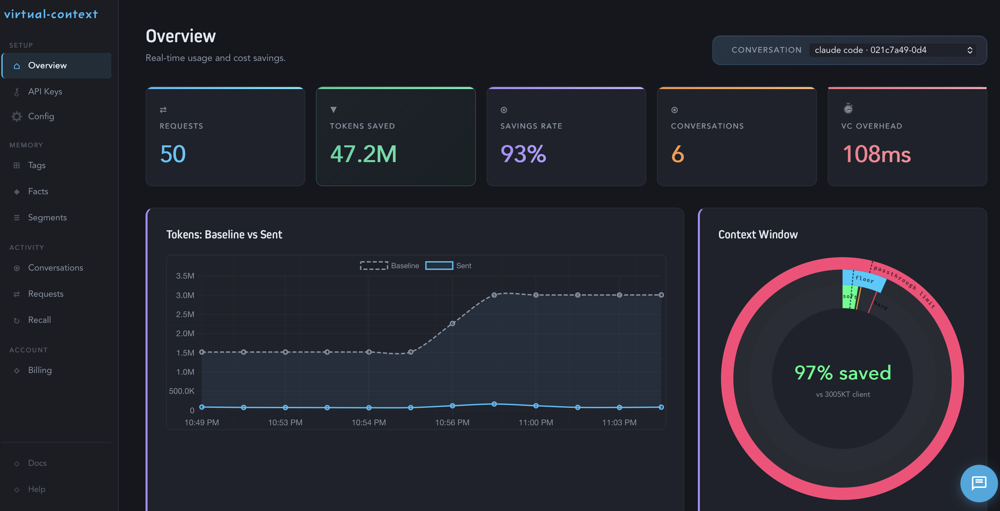

<!-- [](https://pypi.org/project/virtual-context/) -->
<!-- [](https://pypi.org/project/virtual-context/) -->
<!-- [](https://pypistats.org/packages/virtual-context) -->
<!-- [](https://github.com/yursilkidwai/virtual-context/blob/main/LICENSE) -->
[](https://discord.gg/YxDHKEZz)
[](https://x.com/virtualctx)

<p align="center">
  <a href="assets/dashboard.png">
    
  </a>
</p>
<p align="center"><sub>virtual-context cloud: running 3 million virtual token window at 80k actual tokens</sub></p>

# virtual-context

**100x your agent's context by virtualizing it. Better reasoning. Persistent memory. Shared across platforms. Lower costs.**

*95% accuracy vs 33% baseline on the same model, at half the cost. [See benchmark →](#benchmark-results)*

Your client sets `contextWindow: 20000000` (20 million). Your model's real window is 200K. virtual-context sits between them and makes it work, the same way your OS lets a process address more memory than physically exists. The client sends its full conversation history. VC compresses, indexes, and pages. The model sees a dense 60K window where every token is signal.

Virtualizing the context window has many advantages:

- **Compression**: Topic-level summarization with structured fact extraction, tool chain stubbing (52 tool call/response pairs collapse to a single retrievable stub), and image scaling (a 391KB base64 screenshot becomes ~40KB, cutting payload size by ~90%). A 937K-token payload collapses to ~65K. Everything is stored, indexed, and recoverable at full fidelity.
- **Memory**: Your agent recalls what the user said at turn 12 when it reaches turn 1000. Facts, preferences, and decisions persist across the full conversation, not just what fits in the raw window.
- **Reasoning quality**: A curated 60K window of dense signal produces measurably better answers than a raw 200K window full of noise. The model reasons over what matters, not over everything.
- **Cost**: Smaller payloads, fewer tokens billed. A conversation running at a 1M-token virtual window regularly produces 60-90K actual payloads, a fraction of the raw cost. The payload is organized to maximize prompt cache hits, so even compressed conversations achieve significant caching in most cases.
- **Cache-Aware Payload Compaction**: VC compacts conversations in the background but defers rewriting the request payload until the provider's prompt cache has expired or the context window is nearly full. This preserves the byte-identical prefix that providers use for cache hits, giving you compaction savings without sacrificing cached-token discounts. You get full compaction savings when they're free and full cache savings when they matter.
- **Collaboration**: VCATTACH lets agents share memory across platforms and sessions. Custom agents, local tools, and API clients can all work from the same context. Multiple agents collaborate through shared memory. Conversations survive client restarts, platform switches, and session boundaries.

This is what makes virtual-context fundamentally different from memory systems that bolt a vector database onto your LLM. Those systems are *additive*: they retrieve chunks and compete for the context window your agent is working in right now. They do nothing to evict or curate what's already there.

virtual-context *manages* the window itself: compressing by topic, extracting structured facts, paging in what's needed, and paging out what's not. The client thinks it has 20M tokens. The model sees 60K of curated signal. Nothing is lost. Everything is addressable, at varying levels of compression.

```
Layer 0: Raw conversation turns              (active memory, in the context window)
Layer 1: Segment summaries + Facts per tag   (compressed pages, per-topic summaries)
Layer 2: Tag summaries via greedy set cover   (working set descriptors, bird's-eye view)
```

**[Full documentation →](https://virtual-context.com/docs/)** including [architecture and pipeline](https://virtual-context.com/docs/architecture/), [features deep dive](https://virtual-context.com/docs/capabilities/), [proxy internals](https://virtual-context.com/docs/proxy/), [design decisions](https://virtual-context.com/docs/design/), and [user commands](https://virtual-context.com/docs/vcattach/).

## Cloud Offering

[https://virtual-context.com](https://virtual-context.com) is the fastest way to get going. Sign up and change your base-url. Statistics, visibility into the context window, and cost savings reports included.

## Install

```bash
pip install virtual-context
```

Python 3.11+, all core dependencies in the base install.

Optional storage backends: `pip install virtual-context[postgres]`, `[neo4j]`, or `[falkordb]`.

## Integration

virtual-context runs as a local HTTP proxy between your client and the upstream LLM API. Point your client at `localhost:5757` instead of the upstream. The proxy handles everything transparently: tagging, retrieval, history filtering, compaction, tool interception. Auto-detects Anthropic, OpenAI (Chat + Codex/Responses), and Gemini request formats.

```bash
virtual-context proxy --upstream https://api.anthropic.com
# OR
virtual-context proxy --upstream https://api.openai.com
# OR
virtual-context proxy --upstream https://generativelanguage.googleapis.com
```

No config file needed for basic usage. For customization:

```bash
cp virtual-context.yaml.example virtual-context.yaml
virtual-context -c virtual-context.yaml proxy
```

### Claude Code

Point Claude Code at the proxy. Either set the environment variable:

```bash
export ANTHROPIC_BASE_URL=http://127.0.0.1:5757
```

Or add it to your shell profile (`~/.bashrc`, `~/.zshrc`) to make it permanent:

```bash
alias claudevc='ANTHROPIC_BASE_URL=http://127.0.0.1:5757 claude'
```

Claude Code's tool chains (file reads, searches, command output) are automatically compressed. A 937K-token payload with 52 tool chains collapses to ~65K. When Claude Code truncates history to manage its own context window, virtual-context detects the truncation and recovers stored context transparently.

### OpenClaw

Set these to allow OpenClaw to maintain large context windows from a client perspective:

```
  // 1. History limits (the real bottleneck most users will hit)
  // channels.<provider> (e.g. channels.telegram)
  "historyLimit": 99999,
  "dmHistoryLimit": 99999

  // global fallback
  "messages": { "groupChat": { "historyLimit": 99999 } }

  // 2. Model context window: must be on the provider in the per-agent models.json, with
  // explicit model entries:
  "anthropic": {
    "baseUrl": "https://anthropic.virtual-context.com?vckey=...",
    "api": "anthropic-messages",
    "models": [
      {
        "id": "claude-opus-4-6",
        "contextWindow": 2000000,  // Note this is 2M
        ...
      }
    ]
  }
```

  Just setting baseUrl alone isn't enough. Without model entries, it falls back to pi-ai's
  hardcoded 200K. And models.overrides in the global config is display only; it doesn't affect
  actual windowing.

```
  3. Context pruning: disable it so the proxy controls windowing:
  "agents": {
    "defaults": {
      "contextPruning": { "mode": "off" },
      "contextTokens": 2000000 // Note this is 2M
    }
  }

  4. Session idle timeout: prevent OpenClaw from resetting sessions too early.
  Without this, sessions reset after 12 hours by default, wiping the client-side
  history before VC can manage it:
  "session": {
    "resetByType": {
      "group": { "idleMinutes": 2880 }   // 48 hours (default is 720 / 12h)
    }
  }
```

A dedicated [OpenClaw plugin](https://github.com/openclaw/openclaw/pull/12082) is also in progress, using lifecycle hooks for sync retrieval (`message.pre`) and fire-and-forget compaction (`agent.post`).

### Other Clients (Cursor, Continue, any OpenAI-compatible client)

Any client that lets you set a base URL works. Point it at `http://127.0.0.1:5757` (Anthropic format) or `http://127.0.0.1:5757/v1` (OpenAI format):

```python
# Python (anthropic SDK)
import anthropic
client = anthropic.Anthropic(base_url="http://127.0.0.1:5757")

# Python (openai SDK)
from openai import OpenAI
client = OpenAI(base_url="http://127.0.0.1:5757/v1")
```

**Multi-instance mode** runs multiple providers on different ports in one process:

```yaml
proxy:
  instances:
    - port: 5757
      upstream: https://api.anthropic.com
      label: anthropic
    - port: 5758
      upstream: https://api.openai.com
      label: openai
    - port: 5760
      upstream: https://generativelanguage.googleapis.com
      label: gemini
```

**Daemon mode** runs the proxy as a background service:

```bash
virtual-context daemon install --upstream https://api.anthropic.com
virtual-context onboard --install-daemon
```

Daemon lifecycle: `daemon status | start | stop | restart | uninstall`

Full setup docs (macOS `launchd`, Linux `systemd --user`, Windows Task Scheduler): [`docs/install.md`](docs/install.md)

### Python SDK

Two function calls wrap your existing LLM pipeline:

```python
from virtual_context import VirtualContextEngine, Message

engine = VirtualContextEngine(config_path="./virtual-context.yaml")

# BEFORE sending to LLM: retrieve relevant stored context
assembled = engine.on_message_inbound(
    message="What was the Henninger filing deadline?",
    conversation_history=messages,
)
# assembled.prepend_text → enriched system prompt with retrieved summaries
# assembled.matched_tags → ["legal", "filing"]

# AFTER LLM responds: tag, index, compact if needed
report = engine.on_turn_complete(messages)
if report:
    print(f"Compacted {report.segments_compacted} segments, freed {report.tokens_freed:,} tokens")
```

### MCP Server

virtual-context also exposes an MCP server for Claude Desktop, Cursor, or any MCP-compatible client. The model calls tools like `recall_all`, `remember_when`, `find_quote`, `query_facts`, `expand_topic`, and `collapse_topic` internally to build robust memory. These are not user-facing commands; the model decides when to use them based on what the conversation needs.

## What It Does

### Automatic Topic Tagging

There are no predefined domains to configure. An LLM tagger reads each turn and generates semantic tags (`database`, `auth`, `fitness`, `legal`) that naturally converge over the session. A vocabulary feedback loop passes known tags back into the tagger prompt, so it reuses `storage` instead of inventing `data-persistence` or `file-management`. When synonyms slip through (`db` vs `database`), a canonicalizer detects aliases via edit distance and normalizes them automatically.

When a tag appears on too many turns and loses discriminative power, virtual-context detects this and automatically splits it into narrower sub-tags. In a 143-turn OpenClaw session, `reservation-request` (43 turns, 30%) was split into `reservation-platform-troubleshooting`, `reservation-availability-search`, `reservation-browser-access`, and `reservation-general`. The vocabulary evolves toward maximum precision without manual curation.

### Structured Fact Extraction

Summaries compress information but inevitably lose specific details. When the user says "I run 5K every morning" at turn 14, a summary might retain "runs regularly" but drop the exact distance and timing.

virtual-context extracts structured facts during compaction: subject, verb, object, fact type (`preference`, `biographical`, `decision`, `plan`, `routine`, `medical`, `financial`), temporal status (`active`, `completed`, `planned`, `abandoned`, `recurring`), session provenance, and source turn numbers. Facts are queryable by any combination of these fields.

When new information contradicts a stored fact ("I moved from NYC to LA"), the supersession checker detects the conflict and marks the old fact as superseded. Facts have typed relationships (`SUPERSEDES`, `CAUSED_BY`, `PART_OF`, `CONTRADICTS`, `SAME_AS`, `RELATED_TO`) that are automatically detected and traversed during queries.

### Tool Chain Compression

Agent conversations are dominated by tool calls. A coding session with 50 tool rounds might have 900K tokens of tool output but only 60K of actual conversation.

virtual-context collapses entire tool chains into compact stubs:

```
Before (3 messages, ~18K tokens):
  assistant: [tool_use: Read file.py]
  user:      [tool_result: <full 500-line file contents>]
  assistant: "The file has a bug on line 42..."

After (2 messages, ~200 tokens):
  user:      [compacted turn: Read(file.py)]
  assistant: "The file has a bug on line 42..."
```

Handles all four provider formats (Anthropic, OpenAI Chat, OpenAI Responses, Gemini). Full raw tool output is stored durably and recoverable on demand. Past a configurable age threshold, stubs are dropped entirely (the segment summaries already cover that content).

### Media Compression

Base64 images in API payloads are enormous: a single screenshot is 300-500KB of base64. Providers process images through vision encoders with fixed token costs based on dimensions, not base64 string length, but payload size still matters for bandwidth, latency, and TTFB. virtual-context compresses images on first sight: a 391KB screenshot becomes ~40KB, cutting payload size by ~90%. Originals are stored to disk for recovery. This runs on both passthrough and active paths, so even conversations that haven't triggered compaction benefit.

### Virtual Memory Paging

RAG retrieves content and appends it to the context window. It never frees space from what's already there. virtual-context treats the context window as managed memory with bidirectional paging:

```
Tag summaries  <------->  Segment summaries  <------->  Full stored text
     ^                          ^                            ^
  collapse                   default                      expand
  (~200t)                  (~2,000t)                   (~8,000t+)
```

When the model needs more detail on a topic, it expands that topic from summary to full stored text. When budget pressure hits, cold topics are automatically collapsed. The working set persists across turns, so expansion decisions are stateful.

### Cross-Vocabulary Retrieval

Users don't use the same words every time. "Materialized views for feed performance" at turn 46 might be recalled as "that caching trick for the feed" at turn 71. Pure tag overlap finds nothing.

virtual-context uses 3-signal retrieval scoring via Reciprocal Rank Fusion: IDF-weighted tag overlap, BM25 keyword search on summaries, and embedding cosine similarity. Related tags generated at both write time and query time bridge vocabulary gaps. When tag-based retrieval misses entirely, full-text and semantic search across stored conversation text provide a fallback.

### Time-Scoped Recall

Queries like "going back to the very beginning, what were the key decisions?" or "between June and July, what changed?" reference a position in time, not just a topic. virtual-context combines semantic query matching with structured time ranges. Date math is backend-resolved, not LLM-resolved, so results are deterministic. Session dates propagate through the entire pipeline: every segment knows when it happened, and temporal ordering is always accurate.

### Configurable Context Ceiling

Most teams set `context_window` to whatever the model supports and let it fill up. This is expensive and degrades quality. Research on "lost in the middle" shows that LLM attention degrades in long contexts: facts buried in 200K tokens of raw history are missed more often than the same facts concentrated in a managed window.

```yaml
context_window: 60000  # run a 200K model at 60K
compaction:
  soft_threshold: 0.70
  hard_threshold: 0.90
```

A 200K-capable model running at 60K uses ~70% fewer input tokens per request. The model's attention is concentrated on curated, high-signal context rather than spread across mostly-stale history.

### Store-Backed Recovery

Clients (Claude Code, OpenClaw) sometimes truncate conversation history to manage their own context windows. virtual-context detects the truncation and recovers from its durable store: chain snapshots, recent raw turns, sanitized and restored transparently. The payload that reaches the LLM contains the recovered context as if it had never been truncated.

## User Commands

Type these as normal messages in any client connected through the proxy. Case-insensitive. The proxy intercepts them before they reach the LLM, so no tokens are consumed.

| Command | What it does |
|---|---|
| `VCATTACH <label\|id>` | Reattach to another conversation by label or UUID |
| `VCLABEL <name>` | Set label on current conversation (no arg = show current) |
| `VCSTATUS` | Show conversation ID, label, turns, segments, working set, active tags |
| `VCRECALL <query>` | Search stored context, promote matching tags to working set for next turn |
| `VCCOMPACT` | Force compaction of uncompacted turns |
| `VCLIST` | List all conversations with labels and turn counts |
| `VCFORGET <tag>` | Delete segments and summaries for a specific tag |

### VCATTACH: Shared Memory Across Platforms

Every conversation gets a stable identity derived from the system prompt hash and conversation markers embedded in assistant responses. This identity persists across restarts, deploys, and client changes.

When identity detaches (system prompt changes, client truncation loses the marker, a deploy produces a different hash), type `VCATTACH <label>` to reconnect to the original conversation with all segments, facts, and tags intact.

**Cross-platform shared memory.** Build up deep context in Claude Code (architecture decisions, code patterns, debugging history), then type `VCATTACH code-project` in a Telegram conversation with a different model. Both clients now share the same conversation identity: messages from either platform enrich the same compacted knowledge base. This isn't document sharing or chat mirroring. It's shared memory across platforms and models.

**Multi-agent collaboration.** Two agents (or two humans using different clients) can work on the same problem space simultaneously. Agent A researches in Claude Code, compacting findings. Agent B drafts a proposal in Telegram, pulling from the same segments. Each agent's contributions are compacted into the shared store. The virtual context IS the shared workspace.

**Conversation merging.** Two conversations about the same topic? Pick the one with richer context and `VCATTACH` the other to it. The old conversation is deleted; the target keeps all its compacted data. The alias table is persistent, so stale markers follow the alias instead of creating orphans.

## Virtual-Context vs RAG vs Compaction

These approaches are complementary. RAG, other memory systems, and compaction can all run alongside virtual-context.

| | RAG | Compaction-only | virtual-context |
|---|---|---|---|
| **Primary mechanism** | Query-time retrieval by embedding similarity | Summarize old history to fit window | Tagged memory + retrieval + compaction + paging tools |
| **What gets kept** | External documents + recent raw chat | Summaries of old turns + recent raw chat | Multi-layer memory (raw turns, segment summaries, tag summaries) |
| **Specific fact lookup** | Depends on embedding/query phrasing alignment | Lossy after summarization | Structured fact queries + full-text search + summary drill-down |
| **Broad overview** | Weak unless special orchestration | Can summarize, but often generic | All topic summaries loaded within budget |
| **Time-scoped recall** | Custom logic outside core RAG | Requires date fidelity in summaries | Backend-resolved time ranges with session date propagation |
| **Vocabulary mismatch tolerance** | Embedding-dependent | Low | 3-signal RRF fusion + related-tag expansion + semantic search fallback |
| **Context budget control** | Append retrieved chunks | Compression with limited rehydration | Explicit paging: expand/collapse topics with bounded assembly |
| **Cost at scale** | Grows with corpus size | Grows with conversation length | Configurable ceiling: run a 200K model at 30K |
| **Best fit** | Knowledge/doc retrieval | Simple long-chat cost reduction | Long-running agent memory with mixed query types |

## Proxy Features

The proxy includes a [live dashboard](#live-dashboard) at `http://localhost:5757/dashboard` with request grid, turn inspector, session stats, telemetry, and SSE live updates.

- **Conversation continuity** via invisible markers in assistant responses, with stable identity derived from system prompt hash
- **Redis session cache** for lossless restarts across container deploys (falls back gracefully if Redis is unavailable)
- **Four-format support** auto-detected per request (Anthropic, OpenAI Chat, OpenAI Responses, Gemini)
- **History ingestion** bootstraps the tag index from existing conversation on the first request
- **Streaming with zero added latency** (SSE forwarded byte-for-byte, text accumulated in background)
- **Error-resilient** (engine failures fall back to unmodified passthrough; bloat fallback reverts to original payload)
- **Envelope stripping** extracts sender identity and timestamps from metadata blocks (group chat participants appear as real names)
- **Image-aware token counting** using Anthropic formula, not raw base64 tokenization
- **Per-port config** for multi-instance setups with isolated engines and storage
- **Telemetry** on every LLM call: token counts, cost, timing across five components (`compactor`, `tagger`, `tool_loop`, `fact_curator`, `proxy_upstream`)

## CLI

```bash
virtual-context proxy -u https://api.anthropic.com  # start proxy
virtual-context status                               # tag stats and token usage
virtual-context tags                                 # list all tags
virtual-context domains                              # tags with turn counts and summaries
virtual-context recall auth                          # retrieve stored summaries for a tag
virtual-context retrieve -m "What about auth?"       # tag + retrieve (JSON)
virtual-context transform -m "What about auth?"      # tag + retrieve + assemble
virtual-context compact -i msgs.json                 # manual compaction
virtual-context aliases list|suggest|add             # tag alias management
virtual-context init coding                          # create config from preset
virtual-context onboard [--upstream URL]              # guided setup (interactive wizard)
virtual-context daemon install|status|start|stop     # background service
virtual-context config validate                      # check config syntax
virtual-context telemetry [--verbose] [--json]       # cost, tokens, timing
virtual-context chat [--headless] [--replay ...]     # interactive TUI or headless
```

## Interactive Chat (TUI)

```bash
virtual-context chat --config virtual-context.yaml
```

Terminal chat interface with live context visualization: tag panel with activity levels, real-time budget bar, turn inspector (Ctrl+I), manual compaction (`/compact` or Ctrl+K), session export (Ctrl+S). Headless mode (`--headless --replay prompts.txt`) for automated testing and regression validation.

## Stress-Tested

Validated against adversarial 100-turn conversations with deliberately overlapping domains, vocabulary mismatches, ambiguous callbacks, and cross-domain synthesis queries, using a 3,000-token context window with Claude Haiku. 89% pass rate on 28 deliberately adversarial prompts. Tag vocabulary stabilizes within 10-15 turns via the feedback loop.

Also validated in production with OpenClaw (Telegram) handling real multi-topic conversations: tool chain preservation across 90-message conversations (52 messages filtered to 27 without breaking a single tool dependency), live embedding matching against 40+ tag vocabularies, and single-pass history ingestion of 43 pre-existing turns.

## Benchmark Results

### LongMemEval (100 Questions)

100 random questions from [LongMemEval-500](https://github.com/xiaowu0162/LongMemEval) (5 batches x 20, seeds 42/99/777/1234/2025).

**Configuration:**
- **VC:** MiMo-V2-Flash (ingestion) + Claude Sonnet 4.5 (reader) + Gemini 3 Pro Preview (judge)
- **Baseline:** Claude Sonnet 4.5 with full conversation history (~118K tokens) + Gemini 3 Pro Preview (judge)

| Metric | VC | Baseline |
|--------|-----|----------|
| Accuracy | 95/100 (95%) | 33/100 (33%) |
| Avg Tokens/Question | 52,347 | 117,582 |
| Avg Cost/Question | $0.16 | $0.36 |
| Total Cost | $15.99 | $35.56 |
| Token Reduction | 2.2x fewer | -- |

#### Accuracy by Question Type

| Category | Count | VC | Baseline |
|----------|-------|----|----------|
| knowledge-update | 17 | 100.0% (17/17) | 29.4% (5/17) |
| multi-session | 26 | 88.5% (23/26) | 15.4% (4/26) |
| temporal-reasoning | 28 | 92.9% (26/28) | 32.1% (9/28) |
| single-session-user | 13 | 100.0% (13/13) | 46.2% (6/13) |
| single-session-assistant | 11 | 100.0% (11/11) | 72.7% (8/11) |
| single-session-preference | 5 | 100.0% (5/5) | 20.0% (1/5) |

<details>
<summary>Click to expand full results table (100 questions)</summary>

| ID | Type | BL | BL Tokens | BL Cost | VC | VC Tokens | VC Cost |
|----|------|-----|-----------|---------|-----|-----------|---------|
| `07741c44` | knowledge-update | FAIL | 116,404 | $0.35 | pass | 49,721 | $0.15 |
| `0977f2af` | knowledge-update | FAIL | 117,359 | $0.35 | pass | 49,734 | $0.15 |
| `0ddfec37` | knowledge-update | FAIL | 115,848 | $0.35 | pass | 43,780 | $0.13 |
| `2133c1b5_abs` | knowledge-update | pass | 116,186 | $0.36 | pass | 56,533 | $0.17 |
| `2698e78f_abs` | knowledge-update | FAIL | 118,841 | $0.36 | pass | 36,039 | $0.11 |
| `3ba21379` | knowledge-update | FAIL | 116,604 | $0.35 | pass | 46,034 | $0.14 |
| `4b24c848` | knowledge-update | pass | 117,107 | $0.35 | pass | 32,494 | $0.10 |
| `4d6b87c8` | knowledge-update | FAIL | 115,104 | $0.35 | pass | 47,262 | $0.14 |
| `50635ada` | knowledge-update | FAIL | 118,682 | $0.36 | pass | 41,677 | $0.13 |
| `5a4f22c0` | knowledge-update | pass | 118,775 | $0.36 | pass | 35,437 | $0.11 |
| `6071bd76` | knowledge-update | FAIL | 117,904 | $0.36 | pass | 36,618 | $0.11 |
| `6aeb4375` | knowledge-update | pass | 115,001 | $0.35 | pass | 38,984 | $0.12 |
| `89941a94` | knowledge-update | FAIL | 117,038 | $0.35 | pass | 45,347 | $0.14 |
| `8fb83627` | knowledge-update | pass | 115,488 | $0.35 | pass | 35,041 | $0.11 |
| `a1eacc2a` | knowledge-update | FAIL | 117,513 | $0.35 | pass | 46,401 | $0.14 |
| `cf22b7bf` | knowledge-update | FAIL | 115,784 | $0.35 | pass | 49,002 | $0.15 |
| `ed4ddc30` | knowledge-update | FAIL | 118,045 | $0.36 | pass | 37,708 | $0.11 |
| `099778bb` | multi-session | FAIL | 118,622 | $0.36 | pass | 33,375 | $0.10 |
| `09ba9854` | multi-session | FAIL | 115,128 | $0.35 | FAIL | 36,120 | $0.11 |
| `0ea62687` | multi-session | FAIL | 116,840 | $0.36 | pass | 36,910 | $0.11 |
| `21d02d0d` | multi-session | FAIL | 119,667 | $0.36 | pass | 44,069 | $0.13 |
| `36b9f61e` | multi-session | FAIL | 116,713 | $0.35 | pass | 42,919 | $0.13 |
| `3fe836c9` | multi-session | FAIL | 117,954 | $0.35 | pass | 45,463 | $0.14 |
| `46a3abf7` | multi-session | FAIL | 117,783 | $0.35 | pass | 132,933 | $0.40 |
| `6456829e_abs` | multi-session | FAIL | 117,467 | $0.35 | pass | 42,898 | $0.13 |
| `681a1674` | multi-session | FAIL | 118,545 | $0.36 | pass | 62,141 | $0.19 |
| `720133ac` | multi-session | FAIL | 120,053 | $0.37 | pass | 50,205 | $0.15 |
| `7405e8b1` | multi-session | FAIL | 118,694 | $0.36 | pass | 50,989 | $0.16 |
| `88432d0a` | multi-session | FAIL | 118,401 | $0.36 | pass | 46,391 | $0.14 |
| `88432d0a_abs` | multi-session | pass | 119,275 | $0.36 | pass | 55,463 | $0.17 |
| `9d25d4e0` | multi-session | FAIL | 117,978 | $0.36 | pass | 83,295 | $0.25 |
| `a11281a2` | multi-session | FAIL | 119,807 | $0.36 | pass | 49,939 | $0.15 |
| `a346bb18` | multi-session | FAIL | 118,452 | $0.36 | pass | 44,404 | $0.14 |
| `a96c20ee` | multi-session | FAIL | 117,282 | $0.35 | pass | 42,068 | $0.13 |
| `bf659f65` | multi-session | FAIL | 114,781 | $0.35 | FAIL | 41,952 | $0.13 |
| `d682f1a2` | multi-session | FAIL | 117,856 | $0.35 | pass | 48,821 | $0.15 |
| `dd2973ad` | multi-session | pass | 117,351 | $0.36 | pass | 56,463 | $0.17 |
| `e56a43b9` | multi-session | pass | 119,177 | $0.36 | pass | 47,528 | $0.14 |
| `e6041065` | multi-session | FAIL | 117,316 | $0.35 | pass | 38,473 | $0.12 |
| `eeda8a6d` | multi-session | FAIL | 118,197 | $0.36 | pass | 45,726 | $0.14 |
| `ef66a6e5` | multi-session | FAIL | 116,328 | $0.35 | pass | 152,680 | $0.46 |
| `gpt4_372c3eed` | multi-session | pass | 117,552 | $0.36 | FAIL | 46,299 | $0.14 |
| `gpt4_d84a3211` | multi-session | FAIL | 116,459 | $0.35 | pass | 51,487 | $0.16 |
| `0db4c65d` | temporal-reasoning | FAIL | 115,780 | $0.35 | pass | 45,639 | $0.14 |
| `2ebe6c90` | temporal-reasoning | FAIL | 115,113 | $0.35 | pass | 39,883 | $0.12 |
| `6613b389` | temporal-reasoning | pass | 119,268 | $0.37 | pass | 41,228 | $0.13 |
| `a3045048` | temporal-reasoning | FAIL | 116,689 | $0.35 | pass | 47,120 | $0.14 |
| `b29f3365` | temporal-reasoning | FAIL | 118,078 | $0.36 | pass | 43,563 | $0.13 |
| `c8090214_abs` | temporal-reasoning | pass | 116,460 | $0.35 | pass | 79,046 | $0.24 |
| `cc6d1ec1` | temporal-reasoning | pass | 116,218 | $0.35 | pass | 47,747 | $0.15 |
| `eac54adc` | temporal-reasoning | FAIL | 119,492 | $0.36 | pass | 40,470 | $0.12 |
| `f0853d11` | temporal-reasoning | pass | 116,117 | $0.35 | pass | 46,903 | $0.14 |
| `gpt4_18c2b244` | temporal-reasoning | FAIL | 119,183 | $0.36 | pass | 53,922 | $0.17 |
| `gpt4_1a1dc16d` | temporal-reasoning | FAIL | 120,646 | $0.37 | pass | 52,119 | $0.16 |
| `gpt4_1e4a8aec` | temporal-reasoning | pass | 118,208 | $0.36 | pass | 48,286 | $0.15 |
| `gpt4_21adecb5` | temporal-reasoning | FAIL | 119,249 | $0.36 | pass | 125,864 | $0.38 |
| `gpt4_483dd43c` | temporal-reasoning | FAIL | 117,942 | $0.35 | pass | 43,327 | $0.13 |
| `gpt4_4929293b` | temporal-reasoning | FAIL | 118,774 | $0.37 | pass | 58,869 | $0.18 |
| `gpt4_4cd9eba1` | temporal-reasoning | pass | 119,611 | $0.36 | pass | 46,083 | $0.14 |
| `gpt4_5438fa52` | temporal-reasoning | FAIL | 114,753 | $0.35 | pass | 51,194 | $0.16 |
| `gpt4_65aabe59` | temporal-reasoning | FAIL | 115,392 | $0.35 | pass | 39,931 | $0.12 |
| `gpt4_70e84552` | temporal-reasoning | FAIL | 117,453 | $0.35 | pass | 42,109 | $0.13 |
| `gpt4_7ca326fa` | temporal-reasoning | FAIL | 116,432 | $0.35 | pass | 51,589 | $0.16 |
| `gpt4_7de946e7` | temporal-reasoning | pass | 117,096 | $0.35 | pass | 44,183 | $0.14 |
| `gpt4_8279ba02` | temporal-reasoning | FAIL | 115,780 | $0.35 | pass | 156,923 | $0.47 |
| `gpt4_88806d6e` | temporal-reasoning | FAIL | 119,052 | $0.36 | pass | 33,463 | $0.10 |
| `gpt4_98f46fc6` | temporal-reasoning | pass | 117,366 | $0.36 | pass | 58,524 | $0.18 |
| `gpt4_d6585ce9` | temporal-reasoning | FAIL | 115,862 | $0.35 | pass | 50,320 | $0.15 |
| `gpt4_d9af6064` | temporal-reasoning | pass | 116,298 | $0.35 | pass | 48,037 | $0.15 |
| `gpt4_f420262c` | temporal-reasoning | FAIL | 116,610 | $0.35 | FAIL | 134,691 | $0.41 |
| `gpt4_f420262d` | temporal-reasoning | FAIL | 118,803 | $0.36 | FAIL | 52,815 | $0.16 |
| `001be529` | ss-user | FAIL | 117,394 | $0.35 | pass | 40,375 | $0.12 |
| `15745da0` | ss-user | FAIL | 120,384 | $0.37 | pass | 53,318 | $0.16 |
| `19b5f2b3` | ss-user | pass | 115,688 | $0.35 | pass | 42,046 | $0.13 |
| `19b5f2b3_abs` | ss-user | pass | 116,214 | $0.35 | pass | 44,256 | $0.14 |
| `37d43f65` | ss-user | FAIL | 117,911 | $0.35 | pass | 72,955 | $0.22 |
| `4fd1909e` | ss-user | FAIL | 119,200 | $0.36 | pass | 50,759 | $0.15 |
| `577d4d32` | ss-user | pass | 116,583 | $0.35 | pass | 48,225 | $0.15 |
| `60d45044` | ss-user | FAIL | 119,224 | $0.36 | pass | 47,125 | $0.14 |
| `853b0a1d` | ss-user | FAIL | 116,684 | $0.35 | pass | 48,110 | $0.15 |
| `8e9d538c` | ss-user | pass | 118,317 | $0.36 | pass | 42,345 | $0.13 |
| `ad7109d1` | ss-user | FAIL | 114,263 | $0.34 | pass | 49,802 | $0.15 |
| `af8d2e46` | ss-user | pass | 114,690 | $0.35 | pass | 53,504 | $0.16 |
| `f4f1d8a4_abs` | ss-user | pass | 118,760 | $0.36 | pass | 46,426 | $0.14 |
| `0e5e2d1a` | ss-assistant | pass | 118,067 | $0.35 | pass | 45,569 | $0.14 |
| `1de5cff2` | ss-assistant | FAIL | 118,432 | $0.36 | pass | 45,809 | $0.14 |
| `28bcfaac` | ss-assistant | pass | 118,509 | $0.36 | pass | 44,713 | $0.14 |
| `41275add` | ss-assistant | FAIL | 118,490 | $0.36 | pass | 51,010 | $0.16 |
| `58470ed2` | ss-assistant | pass | 118,116 | $0.36 | pass | 80,240 | $0.25 |
| `6222b6eb` | ss-assistant | pass | 118,378 | $0.36 | pass | 41,408 | $0.13 |
| `8aef76bc` | ss-assistant | pass | 118,739 | $0.36 | pass | 32,131 | $0.10 |
| `ceb54acb` | ss-assistant | pass | 118,463 | $0.37 | pass | 45,166 | $0.14 |
| `dc439ea3` | ss-assistant | pass | 118,782 | $0.36 | pass | 57,967 | $0.18 |
| `e3fc4d6e` | ss-assistant | FAIL | 115,974 | $0.35 | pass | 51,285 | $0.16 |
| `f523d9fe` | ss-assistant | pass | 119,321 | $0.36 | pass | 58,638 | $0.18 |
| `1a1907b4` | ss-preference | FAIL | 117,865 | $0.35 | pass | 51,663 | $0.16 |
| `1da05512` | ss-preference | FAIL | 120,425 | $0.37 | pass | 54,796 | $0.17 |
| `b0479f84` | ss-preference | FAIL | 117,425 | $0.36 | pass | 48,987 | $0.15 |
| `b6025781` | ss-preference | FAIL | 119,376 | $0.36 | pass | 46,189 | $0.14 |
| `fca70973` | ss-preference | pass | 117,421 | $0.36 | pass | 59,228 | $0.19 |
| **Total** | **100** | **33** | **11,758,181** | **$35.56** | **95** | **5,234,716** | **$15.99** |

</details>

## Development

```bash
git clone https://github.com/virtual-context/virtual-context.git
cd virtual-context
python -m venv .venv && source .venv/bin/activate
pip install -e ".[dev]"
python -m pytest tests/ -v --ignore=tests/ollama    # ~1500 unit tests
python -m pytest tests/ollama/ -v -m ollama          # integration (requires local LLM)
```

## License

AGPL-3.0, Copyright Y. Ahmed Kidwai

For commercial licensing inquiries, contact: ahmed@kidw.ai
