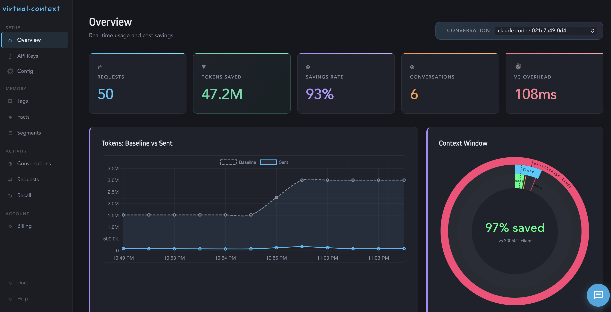

[](https://pypi.org/project/virtual-context/)
[](https://pypi.org/project/virtual-context/)
[](https://pypistats.org/packages/virtual-context)
[](https://github.com/virtual-context/virtual-context/blob/main/LICENSE)
[](https://discord.gg/kGJva2D8Ej)
[](https://x.com/virtualctx)

<p align="center">
  <a href="assets/dashboard.png">
    
  </a>
</p>
<p align="center"><sub>virtual-context cloud: running a 3 million token virtual window at 80k actual tokens</sub></p>

# virtual-context

**Virtual memory for LLM context. Your agent addresses a 20M-token window; the model sees 60K of curated signal.**

*95/100 on LongMemEval vs 33/100 for the same model with raw history, at 55% fewer tokens per question. [Benchmark details below.](#benchmark-results)*

Your client sets `contextWindow: 20000000`. Your model's real window is 200K. virtual-context sits between them and makes it work, the same way an operating system lets a process address more memory than physically exists. The client sends its full conversation history; virtual-context compresses, indexes, and pages it, and forwards a dense window where every token is signal. Nothing is discarded. Everything remains addressable at full fidelity.

It runs as a local HTTP proxy, so no SDK integration is required: point any client at `localhost:5757` instead of the provider URL and it works. A Python SDK and an MCP server exist for direct integration.

## Why virtualize the window

- **Memory that does not expire.** Your agent recalls what the user said at turn 12 when it reaches turn 1000. Facts, preferences, and decisions persist across the whole conversation and across sessions, platforms, and models.
- **Better answers from less context.** A curated 60K window of relevant summaries outperforms a raw 200K window of everything. On LongMemEval, the same reader model scored 95/100 through virtual-context against 33/100 with the full raw history. Long raw contexts bury the fact you need; retrieval surfaces it.
- **Lower cost.** In the benchmark run above, average tokens per question fell from 117,582 to 52,347 and cost per question from $0.36 to $0.16. Compression compounds with prompt caching: payloads are organized to preserve providers' cached prefixes.
- **Group conversations with per-person memory.** In a Telegram group or Discord server, virtual-context knows who said what. Facts carry their author, each member gets a durable person card, and search can be scoped to one speaker. "What has Alice said about the trip?" is answerable from storage, not from the model's guess.
- **One memory across platforms.** Build context in Claude Code, continue it from Telegram, query it from Cursor. `VCATTACH` connects any client to any stored conversation, and a whole community server can share a single memory.
- **A migration path.** `virtual-context import` ingests your existing ChatGPT, Claude, or Grok conversation exports, so the memory starts full instead of empty.

## The memory model

```
Canonical turns   (ground truth: every message stored verbatim, with sender,
                   channel, and reply provenance)
     |
Layer 0: Raw recent turns           (active memory, in the context window)
Layer 1: Segment summaries + facts  (compressed pages, per-topic)
Layer 2: Tag summaries              (one per topic, the bird's-eye view)
```

Every message is durably recorded as a canonical turn. Compaction groups older turns by topic, summarizes each topic independently, and extracts structured facts. The model works from recent raw turns plus retrieved summaries, with a topic index telling it what else it can page in. When it needs more detail on a topic, it expands that topic back toward full text through built-in tools.

## Quick start

```bash
pip install virtual-context        # Python 3.11+
virtual-context proxy --upstream https://api.anthropic.com
```

Point your client at `http://127.0.0.1:5757` instead of the provider. That is the whole integration. The proxy auto-detects Anthropic, OpenAI Chat, OpenAI Responses, and Gemini request formats, and new conversations pass through untouched until there is stored context worth injecting.

A live dashboard runs at `http://127.0.0.1:5757/dashboard` with a request inspector, per-topic state, and cost telemetry.

No config file is needed for basic use. To customize, generate one from a preset and edit it:

```bash
virtual-context init coding        # or: agentic
virtual-context config validate
```

Guided setup, including installation as a background service:

```bash
virtual-context onboard --upstream https://api.anthropic.com
```

Full install options, daemon setup for macOS/Linux/Windows, and storage backends: [docs/install.md](docs/install.md).

### Hosted option

[virtual-context.com](https://virtual-context.com) runs the same engine as a service: sign up, change your base URL, and get the dashboard, statistics, and cost reports without running anything.

## Integrations

### Claude Code

```bash
export ANTHROPIC_BASE_URL=http://127.0.0.1:5757
# or make it a habit:
alias claudevc='ANTHROPIC_BASE_URL=http://127.0.0.1:5757 claude'
```

Claude Code's tool chains (file reads, searches, command output) are compressed automatically: a 937K-token payload with 52 tool chains collapses to about 65K. When Claude Code truncates its own history to manage its window, virtual-context detects the truncation and restores the missing context from storage.

### OpenClaw

A dedicated [OpenClaw plugin](https://github.com/virtual-context/openclaw-plugin) integrates through lifecycle hooks: synchronous retrieval on `message.pre`, fire-and-forget compaction on `agent.post`.

Direct proxy use also works. The settings that matter, since OpenClaw manages its own history aggressively:

```jsonc
// 1. Raise history limits (per channel, e.g. channels.telegram)
"historyLimit": 99999,
"dmHistoryLimit": 99999,
"messages": { "groupChat": { "historyLimit": 99999 } },

// 2. Declare the virtual window on explicit model entries
//    (baseUrl alone is not enough; without model entries the client
//    falls back to its hardcoded 200K)
"anthropic": {
  "baseUrl": "https://anthropic.virtual-context.com?vckey=...",
  "api": "anthropic-messages",
  "models": [{ "id": "claude-opus-4-6", "contextWindow": 2000000 }]
},

// 3. Let the proxy control windowing
"agents": { "defaults": {
  "contextPruning": { "mode": "off" },
  "contextTokens": 2000000
}},

// 4. Keep sessions alive long enough for memory to matter
//    (default group idle reset is 12h)
"session": { "resetByType": { "group": { "idleMinutes": 2880 } } }
```

### Any other client (Cursor, Continue, custom apps)

Anything that lets you set a base URL works:

```python
# anthropic SDK
client = anthropic.Anthropic(base_url="http://127.0.0.1:5757")

# openai SDK
client = OpenAI(base_url="http://127.0.0.1:5757/v1")
```

Multi-instance mode serves several providers from one process, each on its own port with isolated storage; see [docs/install.md](docs/install.md).

### Python SDK

Two calls wrap an existing pipeline:

```python
from virtual_context import VirtualContextEngine

engine = VirtualContextEngine(config_path="./virtual-context.yaml")

# before the LLM call: retrieve relevant stored context
assembled = engine.on_message_inbound(message=user_message, conversation_history=messages)
# assembled.prepend_text  -> enriched system prompt
# assembled.matched_tags  -> the topics retrieval matched

# after the response: persist, tag, compact if needed
report = engine.on_turn_complete(messages)
```

### MCP server

For Claude Desktop, Cursor, or any MCP client. Registers eight tools (`recall_context`, `compact_context`, `expand_topic`, `recall_all`, `remember_when`, `find_quote`, `search_summaries`, `domain_status`), two resources (the topic list with usage statistics, and per-topic summaries), and two prompts. The model decides when to call them.

## What it does

### Automatic topic tagging

No predefined categories. An LLM tagger reads each completed turn and generates semantic tags (`database`, `auth`, `fitness`, `legal`) that converge over the session; a vocabulary feedback loop makes it reuse `storage` instead of inventing `data-persistence`. Synonyms are caught by a canonicalizer, and a tag that grows too broad is automatically split into narrower subtags with aliases preserving retrieval continuity. On the request path, a local embedding tagger assigns tags in milliseconds with no LLM call, so retrieval never waits on a model.

### Structured facts with authorship

Summaries compress; facts preserve the specifics. During compaction, virtual-context extracts structured facts (subject, verb, object, type, temporal status, source turns) and stores them queryable by any field. When new information contradicts an old fact ("I moved from NYC to LA"), a supersession pass marks the old one superseded. Facts carry typed relationships (`SUPERSEDES`, `CAUSED_BY`, `PART_OF`, and others) that queries can traverse.

Every fact also carries its author, taken from the stored message row rather than from model output. In a group chat, "Bob prefers window seats" is recorded as Bob's statement, and a reply is attributed to the person replying, with the quoted material attributed to the person quoted.

### Group conversations that know who is who

Transport metadata (sender, channel, reply target) is claimed at ingestion and stored on every message row. On top of that:

- **Person cards**: a curated, per-member digest of durable identity facts, rebuilt from that member's own recorded speech and injected when they speak. A gate-controlled admission model decides what counts as durable identity rather than a passing remark.
- **Speaker-scoped search**: search tools accept a speaker selection, so "what did I say about this?" resolves to the requester and "what has Alice said?" returns only rows attributed to Alice.
- **Whole-server memory**: a Discord-style community can unify every channel into one conversation. Members keep one identity across channels, sibling-channel activity stays visible, and two fail-closed privacy rules bound it: DM content can never render into server context, and every stored row must carry its own audience proof.

These features ship dark (off by default) and are enabled per deployment. Details: [docs/attribution.md](docs/attribution.md).

### Tool chain compression

Agent conversations are dominated by tool output. A coding session can carry 900K tokens of tool results and 60K of actual conversation. virtual-context collapses completed tool exchanges into compact stubs with a restore reference:

```
Before (3 messages, ~18K tokens):          After (2 messages, ~200 tokens):
  assistant: [tool_use: Read file.py]        user:      [compacted turn: Read(file.py)]
  user:      [tool_result: 500 lines]        assistant: "The bug is on line 42..."
  assistant: "The bug is on line 42..."
```

Full output is stored durably and the model can recover any chain on demand via `vc_restore_tool`. Old stubs past a configurable age are dropped entirely once segment summaries cover them.

### Media compression

A single screenshot is 300-500KB of base64. virtual-context recompresses images on first sight (a 391KB screenshot becomes about 40KB), stores the originals for recovery, and counts image tokens by the provider's dimension formula instead of the base64 length. This runs on the passthrough path too, so brand-new conversations benefit.

### Demand paging

Retrieval is bidirectional. The model sees tag summaries for cold topics, segment summaries for relevant ones, and full text where it asks for it:

```
Tag summaries  <------->  Segment summaries  <------->  Full stored text
   ~200t                      ~2,000t                       ~8,000t+
  collapse                    default                        expand
```

The working set persists across turns, cold topics collapse under budget pressure, and the model drives expansion through tools when it needs detail.

### Retrieval that survives vocabulary drift

"Materialized views for feed performance" at turn 46 gets recalled as "that caching trick for the feed" at turn 71. Three signals are fused per topic with Reciprocal Rank Fusion: IDF-weighted tag overlap, BM25 over summary text, and embedding similarity, with dampening that stops catch-all topics from dominating and a boost for fact-bearing topics. When tags miss entirely, full-text and semantic search over the stored conversation are the fallback.

### Time-scoped recall

"Between June and July, what changed?" resolves through backend date math, not model guessing. The `vc_remember_when` tool takes a structured date range and a mode: point-in-time state, chronology of changes, a synthesis across the range, or a browse of the window. Session dates propagate through the pipeline, so temporal ordering is reliable.

### Code mode

On by default. Summarization and fact extraction switch to coding-aware prompts: investigatory noise ("assistant ran the tests") is not extracted, findings are framed about the artifact ("the endpoint now supports sorting") rather than the assistant, and extraction emits `code_refs`, concrete file/function references that survive compression. Turn it off for purely conversational deployments with `compaction.code_mode: false`.

### Prompt-cache aware

virtual-context places an explicit cache breakpoint (Anthropic format) so the client's stable prompt ends inside the cached region and the injected context sits after it, keeping cache hits flowing even though retrieved context changes every turn. Compaction goes further: with deferral enabled, the payload rewrite that would break the cached prefix waits until the provider's cache has expired anyway or the window approaches its budget, so you get compaction savings when they are free and cache savings when they matter.

### A configurable ceiling

Run a 200K model at 60K:

```yaml
context_window: 60000
compaction:
  soft_threshold: 0.70
  hard_threshold: 0.85
```

Smaller payloads cost less and, per the benchmark above, answer better. The ceiling is yours to choose; the virtual window the client sees is independent of it.

### Truncation recovery

Clients truncate their own history to manage their windows. virtual-context detects it and restores the missing turns from storage, so the payload that reaches the model reads as if nothing was lost. Conversation state (the topic index, working set, watermarks) survives restarts through session snapshots, and a Redis-backed session cache makes proxy redeploys lossless.

### Import your history

```bash
virtual-context import --provider chatgpt --input conversations.json
virtual-context import --provider claude  --input ~/exports/ --compact
```

Adapters for ChatGPT, Claude, and Grok exports; single files or directories. Imported conversations arrive indexed, tagged, and retrievable. Details: [docs/commands.md](docs/commands.md).

## Shared memory across platforms

Type these as ordinary messages in any connected client. The proxy intercepts them; no tokens are spent.

| Command | What it does |
|---|---|
| `VCATTACH <label\|id>` | Reattach to another conversation by label or ID |
| `VCLABEL <name>` | Set the conversation label (no argument shows it) |
| `VCSTATUS` | Conversation ID, label, turns, segments, working set, active tags |
| `VCRECALL <query>` | Search stored context, promote matching topics for the next turn |
| `VCCOMPACT` | Force compaction now |
| `VCLIST` | List conversations with labels and turn counts |
| `VCFORGET <tag>` | Delete a topic's segments and summaries |
| `VCMERGE INTO <label\|id>` | Merge this conversation's stored data into another |
| `VCMERGESTATUS` | Report merge progress |

Every conversation gets a stable identity that survives restarts, deploys, and client changes. When identity detaches (a system prompt change, client truncation, a redeploy), `VCATTACH <label>` reconnects to the original conversation with all segments, facts, and tags intact.

`VCATTACH` is a redirect: the old identity durably routes to the target and nothing is deleted, so stale references keep resolving. Build deep context in Claude Code, then type `VCATTACH code-project` in a Telegram session with a different model; both clients now enrich the same memory. Two agents can work the same problem space simultaneously through it. To combine two conversations' stored data into one, `VCMERGE` does the actual merge. Details: [docs/commands.md](docs/commands.md).

## Running it in production

The engine is built to be operated, not only demoed:

- **Storage**: SQLite by default; PostgreSQL (`pip install "virtual-context[postgres]"`) for multi-worker deployments; both support fact relationships. Filesystem, Neo4j, and FalkorDB classes remain direct utilities, not engine backends.
- **Multi-worker safety**: many workers can serve one conversation against shared Postgres. Compactions run under leased, fenced operations so a stalled worker cannot clobber a takeover; conversation lifecycle changes are epoch-guarded; schema bootstrap is serialized under an advisory lock; a backlog sweeper catches conversations whose traffic pattern never triggers inline compaction.
- **Dashboard security**: dashboard endpoints are unauthenticated until you set `VC_DASHBOARD_TOKEN`; the default bind is loopback-only. Set the token before binding a non-loopback address.
- **Operator tooling**: `virtual-context admin` ships sixteen guarded, idempotent backfill and repair commands (re-tagging, re-summarizing, attribution backfills, embedding reindexes), with explicit storage targeting and per-command dry-run semantics. `DATABASE_URL` lets them run bare inside a container with no config file mounted.
- **Observability**: per-request stage logs (`FLUSH_GATE`, `HISTORY_WIDENED`, `STREAM_FIRST_BYTE`/`STREAM_STALL`/`STREAM_END`, `DROP-COMPACTED`), full request captures in the dashboard that survive restarts, and per-call cost telemetry.

Architecture details, including the canonical-turn model and the REST prepare/ingest surface: [docs/architecture.md](docs/architecture.md).

## virtual-context vs RAG vs compaction

These compose; RAG and compaction can run alongside virtual-context. The difference is what each manages.

| | RAG | Compaction-only | virtual-context |
|---|---|---|---|
| **Mechanism** | Query-time retrieval by similarity | Summarize old history to fit | Tagged memory + retrieval + compaction + paging |
| **What is kept** | External documents + recent chat | Summaries + recent chat | Three layers, from raw turns to topic digests |
| **Specific fact lookup** | Depends on phrasing alignment | Lossy after summarizing | Structured fact queries + full-text + drill-down |
| **Who said it** | Not modeled | Not modeled | Per-message provenance, per-person cards, speaker-scoped search |
| **Time-scoped recall** | Custom logic outside RAG | Needs date fidelity in summaries | Backend-resolved date ranges |
| **Vocabulary drift** | Embedding-dependent | Weak | 3-signal fusion + related tags + semantic fallback |
| **Budget control** | Appends retrieved chunks | Compression only | Explicit paging with a bounded assembly |
| **Cost at scale** | Grows with corpus | Grows with length | A ceiling you set |

RAG retrieves and appends; it never frees space in the window it competes for. Compaction compresses but cannot bring detail back. virtual-context manages the window in both directions.

## CLI

```bash
virtual-context proxy -u https://api.anthropic.com   # start the proxy
virtual-context status                               # tag stats and token usage
virtual-context tags                                 # list all tags
virtual-context recall auth                          # stored summaries for a tag
virtual-context retrieve -m "What about auth?"       # tag + retrieve (JSON)
virtual-context transform -m "What about auth?"      # tag + retrieve + assemble
virtual-context compact -i msgs.json                 # manual compaction
virtual-context import --provider chatgpt -i ...     # import exported history
virtual-context aliases list|suggest|add             # tag alias management
virtual-context init coding                          # config from a preset
virtual-context onboard [--upstream URL]             # guided setup
virtual-context daemon install|status|start|stop     # background service
virtual-context config validate                      # check the config
virtual-context telemetry [--verbose] [--json]       # cost, tokens, timing
virtual-context chat [--headless] [--replay ...]     # interactive TUI
virtual-context admin <subcommand>                   # backfills and repairs
```

The full command and flag reference, including the sixteen admin subcommands: [docs/commands.md](docs/commands.md).

## Interactive chat (TUI)

```bash
virtual-context chat --config virtual-context.yaml
```

A terminal chat with live context visualization: tag panel, budget bar, turn inspector, manual compaction, session export. Headless mode (`--headless --replay prompts.txt`) drives automated testing.

## Benchmark results

### LongMemEval (100 questions)

Historical results; [run-provenance limits](docs/benchmarks.md#longmemeval) apply.

100 random questions from [LongMemEval-500](https://github.com/xiaowu0162/LongMemEval) (5 batches of 20, seeds 42/99/777/1234/2025).

**Configuration:**
- **VC:** MiMo-V2-Flash (ingestion) + Claude Sonnet 4.5 (reader) + Gemini 3 Pro Preview (judge)
- **Baseline:** Claude Sonnet 4.5 with the full conversation history (~118K tokens) + the same judge

| Metric | VC | Baseline |
|--------|-----|----------|
| Accuracy | 95/100 (95%) | 33/100 (33%) |
| Avg tokens/question | 52,347 | 117,582 |
| Avg cost/question | $0.16 | $0.36 |
| Total cost | $15.99 | $35.56 |
| Token reduction | 2.2x fewer | -- |

#### Accuracy by question type

| Category | Count | VC | Baseline |
|----------|-------|----|----------|
| knowledge-update | 17 | 100.0% (17/17) | 29.4% (5/17) |
| multi-session | 26 | 88.5% (23/26) | 15.4% (4/26) |
| temporal-reasoning | 28 | 92.9% (26/28) | 32.1% (9/28) |
| single-session-user | 13 | 100.0% (13/13) | 46.2% (6/13) |
| single-session-assistant | 11 | 100.0% (11/11) | 72.7% (8/11) |
| single-session-preference | 5 | 100.0% (5/5) | 20.0% (1/5) |

<details>
<summary>Click to expand the full results table (100 questions)</summary>

| ID | Type | BL | BL Tokens | BL Cost | VC | VC Tokens | VC Cost |
|----|------|-----|-----------|---------|-----|-----------|---------|
| `07741c44` | knowledge-update | FAIL | 116,404 | $0.35 | pass | 49,721 | $0.15 |
| `0977f2af` | knowledge-update | FAIL | 117,359 | $0.35 | pass | 49,734 | $0.15 |
| `0ddfec37` | knowledge-update | FAIL | 115,848 | $0.35 | pass | 43,780 | $0.13 |
| `2133c1b5_abs` | knowledge-update | pass | 116,186 | $0.36 | pass | 56,533 | $0.17 |
| `2698e78f_abs` | knowledge-update | FAIL | 118,841 | $0.36 | pass | 36,039 | $0.11 |
| `3ba21379` | knowledge-update | FAIL | 116,604 | $0.35 | pass | 46,034 | $0.14 |
| `4b24c848` | knowledge-update | pass | 117,107 | $0.35 | pass | 32,494 | $0.10 |
| `4d6b87c8` | knowledge-update | FAIL | 115,104 | $0.35 | pass | 47,262 | $0.14 |
| `50635ada` | knowledge-update | FAIL | 118,682 | $0.36 | pass | 41,677 | $0.13 |
| `5a4f22c0` | knowledge-update | pass | 118,775 | $0.36 | pass | 35,437 | $0.11 |
| `6071bd76` | knowledge-update | FAIL | 117,904 | $0.36 | pass | 36,618 | $0.11 |
| `6aeb4375` | knowledge-update | pass | 115,001 | $0.35 | pass | 38,984 | $0.12 |
| `89941a94` | knowledge-update | FAIL | 117,038 | $0.35 | pass | 45,347 | $0.14 |
| `8fb83627` | knowledge-update | pass | 115,488 | $0.35 | pass | 35,041 | $0.11 |
| `a1eacc2a` | knowledge-update | FAIL | 117,513 | $0.35 | pass | 46,401 | $0.14 |
| `cf22b7bf` | knowledge-update | FAIL | 115,784 | $0.35 | pass | 49,002 | $0.15 |
| `ed4ddc30` | knowledge-update | FAIL | 118,045 | $0.36 | pass | 37,708 | $0.11 |
| `099778bb` | multi-session | FAIL | 118,622 | $0.36 | pass | 33,375 | $0.10 |
| `09ba9854` | multi-session | FAIL | 115,128 | $0.35 | FAIL | 36,120 | $0.11 |
| `0ea62687` | multi-session | FAIL | 116,840 | $0.36 | pass | 36,910 | $0.11 |
| `21d02d0d` | multi-session | FAIL | 119,667 | $0.36 | pass | 44,069 | $0.13 |
| `36b9f61e` | multi-session | FAIL | 116,713 | $0.35 | pass | 42,919 | $0.13 |
| `3fe836c9` | multi-session | FAIL | 117,954 | $0.35 | pass | 45,463 | $0.14 |
| `46a3abf7` | multi-session | FAIL | 117,783 | $0.35 | pass | 132,933 | $0.40 |
| `6456829e_abs` | multi-session | FAIL | 117,467 | $0.35 | pass | 42,898 | $0.13 |
| `681a1674` | multi-session | FAIL | 118,545 | $0.36 | pass | 62,141 | $0.19 |
| `720133ac` | multi-session | FAIL | 120,053 | $0.37 | pass | 50,205 | $0.15 |
| `7405e8b1` | multi-session | FAIL | 118,694 | $0.36 | pass | 50,989 | $0.16 |
| `88432d0a` | multi-session | FAIL | 118,401 | $0.36 | pass | 46,391 | $0.14 |
| `88432d0a_abs` | multi-session | pass | 119,275 | $0.36 | pass | 55,463 | $0.17 |
| `9d25d4e0` | multi-session | FAIL | 117,978 | $0.36 | pass | 83,295 | $0.25 |
| `a11281a2` | multi-session | FAIL | 119,807 | $0.36 | pass | 49,939 | $0.15 |
| `a346bb18` | multi-session | FAIL | 118,452 | $0.36 | pass | 44,404 | $0.14 |
| `a96c20ee` | multi-session | FAIL | 117,282 | $0.35 | pass | 42,068 | $0.13 |
| `bf659f65` | multi-session | FAIL | 114,781 | $0.35 | FAIL | 41,952 | $0.13 |
| `d682f1a2` | multi-session | FAIL | 117,856 | $0.35 | pass | 48,821 | $0.15 |
| `dd2973ad` | multi-session | pass | 117,351 | $0.36 | pass | 56,463 | $0.17 |
| `e56a43b9` | multi-session | pass | 119,177 | $0.36 | pass | 47,528 | $0.14 |
| `e6041065` | multi-session | FAIL | 117,316 | $0.35 | pass | 38,473 | $0.12 |
| `eeda8a6d` | multi-session | FAIL | 118,197 | $0.36 | pass | 45,726 | $0.14 |
| `ef66a6e5` | multi-session | FAIL | 116,328 | $0.35 | pass | 152,680 | $0.46 |
| `gpt4_372c3eed` | multi-session | pass | 117,552 | $0.36 | FAIL | 46,299 | $0.14 |
| `gpt4_d84a3211` | multi-session | FAIL | 116,459 | $0.35 | pass | 51,487 | $0.16 |
| `0db4c65d` | temporal-reasoning | FAIL | 115,780 | $0.35 | pass | 45,639 | $0.14 |
| `2ebe6c90` | temporal-reasoning | FAIL | 115,113 | $0.35 | pass | 39,883 | $0.12 |
| `6613b389` | temporal-reasoning | pass | 119,268 | $0.37 | pass | 41,228 | $0.13 |
| `a3045048` | temporal-reasoning | FAIL | 116,689 | $0.35 | pass | 47,120 | $0.14 |
| `b29f3365` | temporal-reasoning | FAIL | 118,078 | $0.36 | pass | 43,563 | $0.13 |
| `c8090214_abs` | temporal-reasoning | pass | 116,460 | $0.35 | pass | 79,046 | $0.24 |
| `cc6d1ec1` | temporal-reasoning | pass | 116,218 | $0.35 | pass | 47,747 | $0.15 |
| `eac54adc` | temporal-reasoning | FAIL | 119,492 | $0.36 | pass | 40,470 | $0.12 |
| `f0853d11` | temporal-reasoning | pass | 116,117 | $0.35 | pass | 46,903 | $0.14 |
| `gpt4_18c2b244` | temporal-reasoning | FAIL | 119,183 | $0.36 | pass | 53,922 | $0.17 |
| `gpt4_1a1dc16d` | temporal-reasoning | FAIL | 120,646 | $0.37 | pass | 52,119 | $0.16 |
| `gpt4_1e4a8aec` | temporal-reasoning | pass | 118,208 | $0.36 | pass | 48,286 | $0.15 |
| `gpt4_21adecb5` | temporal-reasoning | FAIL | 119,249 | $0.36 | pass | 125,864 | $0.38 |
| `gpt4_483dd43c` | temporal-reasoning | FAIL | 117,942 | $0.35 | pass | 43,327 | $0.13 |
| `gpt4_4929293b` | temporal-reasoning | FAIL | 118,774 | $0.37 | pass | 58,869 | $0.18 |
| `gpt4_4cd9eba1` | temporal-reasoning | pass | 119,611 | $0.36 | pass | 46,083 | $0.14 |
| `gpt4_5438fa52` | temporal-reasoning | FAIL | 114,753 | $0.35 | pass | 51,194 | $0.16 |
| `gpt4_65aabe59` | temporal-reasoning | FAIL | 115,392 | $0.35 | pass | 39,931 | $0.12 |
| `gpt4_70e84552` | temporal-reasoning | FAIL | 117,453 | $0.35 | pass | 42,109 | $0.13 |
| `gpt4_7ca326fa` | temporal-reasoning | FAIL | 116,432 | $0.35 | pass | 51,589 | $0.16 |
| `gpt4_7de946e7` | temporal-reasoning | pass | 117,096 | $0.35 | pass | 44,183 | $0.14 |
| `gpt4_8279ba02` | temporal-reasoning | FAIL | 115,780 | $0.35 | pass | 156,923 | $0.47 |
| `gpt4_88806d6e` | temporal-reasoning | FAIL | 119,052 | $0.36 | pass | 33,463 | $0.10 |
| `gpt4_98f46fc6` | temporal-reasoning | pass | 117,366 | $0.36 | pass | 58,524 | $0.18 |
| `gpt4_d6585ce9` | temporal-reasoning | FAIL | 115,862 | $0.35 | pass | 50,320 | $0.15 |
| `gpt4_d9af6064` | temporal-reasoning | pass | 116,298 | $0.35 | pass | 48,037 | $0.15 |
| `gpt4_f420262c` | temporal-reasoning | FAIL | 116,610 | $0.35 | FAIL | 134,691 | $0.41 |
| `gpt4_f420262d` | temporal-reasoning | FAIL | 118,803 | $0.36 | FAIL | 52,815 | $0.16 |
| `001be529` | ss-user | FAIL | 117,394 | $0.35 | pass | 40,375 | $0.12 |
| `15745da0` | ss-user | FAIL | 120,384 | $0.37 | pass | 53,318 | $0.16 |
| `19b5f2b3` | ss-user | pass | 115,688 | $0.35 | pass | 42,046 | $0.13 |
| `19b5f2b3_abs` | ss-user | pass | 116,214 | $0.35 | pass | 44,256 | $0.14 |
| `37d43f65` | ss-user | FAIL | 117,911 | $0.35 | pass | 72,955 | $0.22 |
| `4fd1909e` | ss-user | FAIL | 119,200 | $0.36 | pass | 50,759 | $0.15 |
| `577d4d32` | ss-user | pass | 116,583 | $0.35 | pass | 48,225 | $0.15 |
| `60d45044` | ss-user | FAIL | 119,224 | $0.36 | pass | 47,125 | $0.14 |
| `853b0a1d` | ss-user | FAIL | 116,684 | $0.35 | pass | 48,110 | $0.15 |
| `8e9d538c` | ss-user | pass | 118,317 | $0.36 | pass | 42,345 | $0.13 |
| `ad7109d1` | ss-user | FAIL | 114,263 | $0.34 | pass | 49,802 | $0.15 |
| `af8d2e46` | ss-user | pass | 114,690 | $0.35 | pass | 53,504 | $0.16 |
| `f4f1d8a4_abs` | ss-user | pass | 118,760 | $0.36 | pass | 46,426 | $0.14 |
| `0e5e2d1a` | ss-assistant | pass | 118,067 | $0.35 | pass | 45,569 | $0.14 |
| `1de5cff2` | ss-assistant | FAIL | 118,432 | $0.36 | pass | 45,809 | $0.14 |
| `28bcfaac` | ss-assistant | pass | 118,509 | $0.36 | pass | 44,713 | $0.14 |
| `41275add` | ss-assistant | FAIL | 118,490 | $0.36 | pass | 51,010 | $0.16 |
| `58470ed2` | ss-assistant | pass | 118,116 | $0.36 | pass | 80,240 | $0.25 |
| `6222b6eb` | ss-assistant | pass | 118,378 | $0.36 | pass | 41,408 | $0.13 |
| `8aef76bc` | ss-assistant | pass | 118,739 | $0.36 | pass | 32,131 | $0.10 |
| `ceb54acb` | ss-assistant | pass | 118,463 | $0.37 | pass | 45,166 | $0.14 |
| `dc439ea3` | ss-assistant | pass | 118,782 | $0.36 | pass | 57,967 | $0.18 |
| `e3fc4d6e` | ss-assistant | FAIL | 115,974 | $0.35 | pass | 51,285 | $0.16 |
| `f523d9fe` | ss-assistant | pass | 119,321 | $0.36 | pass | 58,638 | $0.18 |
| `1a1907b4` | ss-preference | FAIL | 117,865 | $0.35 | pass | 51,663 | $0.16 |
| `1da05512` | ss-preference | FAIL | 120,425 | $0.37 | pass | 54,796 | $0.17 |
| `b0479f84` | ss-preference | FAIL | 117,425 | $0.36 | pass | 48,987 | $0.15 |
| `b6025781` | ss-preference | FAIL | 119,376 | $0.36 | pass | 46,189 | $0.14 |
| `fca70973` | ss-preference | pass | 117,421 | $0.36 | pass | 59,228 | $0.19 |
| **Total** | **100** | **33** | **11,758,181** | **$35.56** | **95** | **5,234,716** | **$15.99** |

</details>

A full LoCoMo run is not yet published; the figures above are LongMemEval results. Suite descriptions and how to run them: [docs/benchmarks.md](docs/benchmarks.md).

Also validated against adversarial internal stress tests (100-turn conversations with deliberately overlapping domains and vocabulary mismatches at a 3,000-token window) and in production with OpenClaw handling real multi-topic group conversations.

## Documentation

| Page | Covers |
|---|---|
| [architecture.md](docs/architecture.md) | The memory model, request pipeline, multi-worker coordination, identity |
| [engine.md](docs/engine.md) | Compaction, tagging, retrieval scoring, code mode, cache awareness |
| [attribution.md](docs/attribution.md) | Group conversations: who-said-what, person cards, speaker search, guilds |
| [proxy.md](docs/proxy.md) | Proxy internals, routing, dashboard, streaming, endpoints |
| [configuration.md](docs/configuration.md) | Every user-facing config key with defaults |
| [commands.md](docs/commands.md) | In-conversation commands, the CLI, import, admin tooling |
| [install.md](docs/install.md) | Install paths, daemons, per-instance setups |
| [design.md](docs/design.md) | Why it is built this way |
| [benchmarks.md](docs/benchmarks.md) | Suites, results, how to run them |

## Development

```bash
git clone https://github.com/virtual-context/virtual-context.git
cd virtual-context
python -m venv .venv && source .venv/bin/activate
python -m pip install uv==0.9.30
uv sync --locked --extra all --extra dev
.venv/bin/python scripts/check_contracts.py
```

## License

AGPL-3.0, Copyright Y. Ahmed Kidwai

For commercial licensing inquiries: ahmed@kidw.ai
